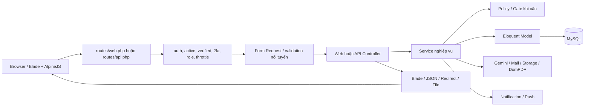
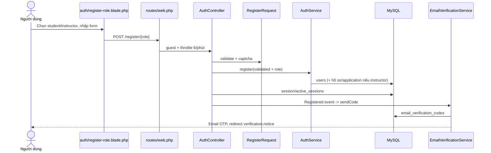
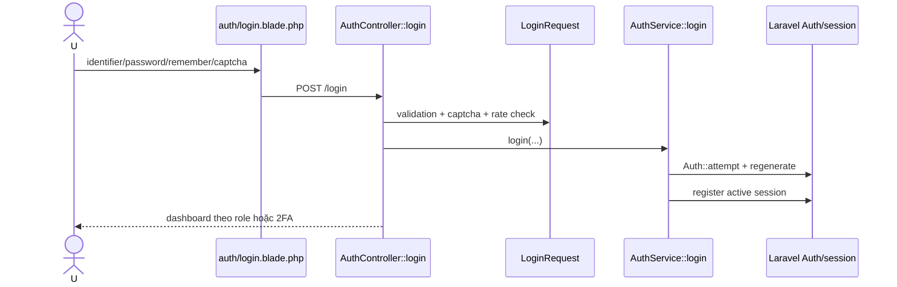
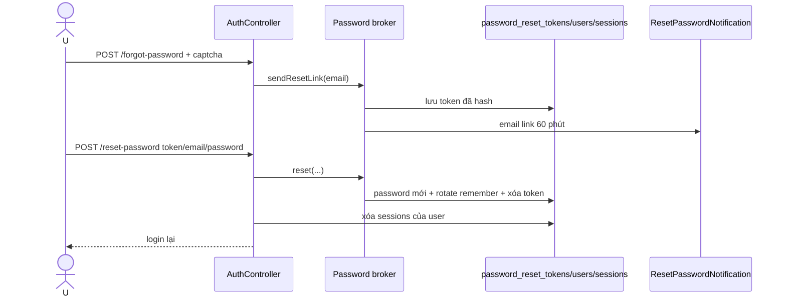
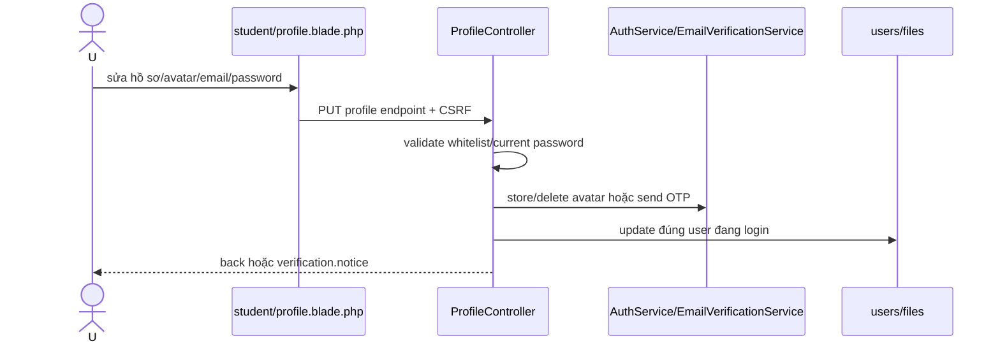
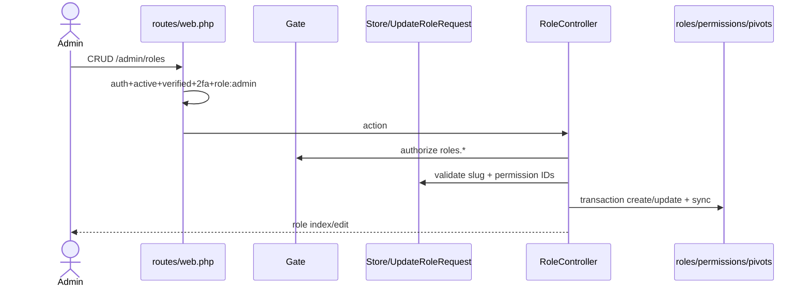
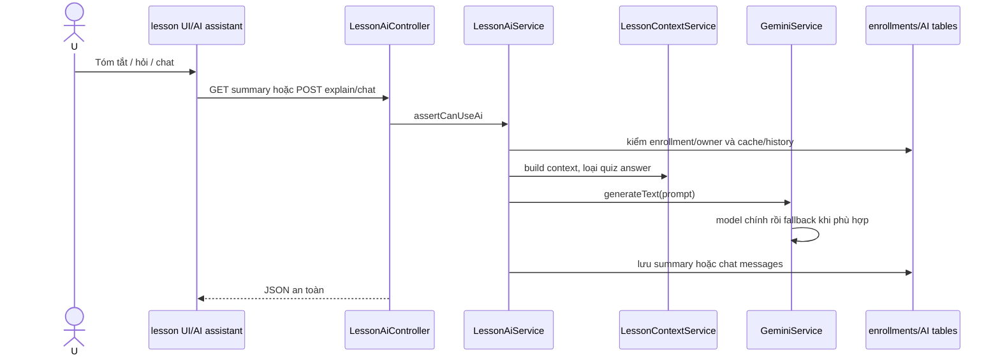
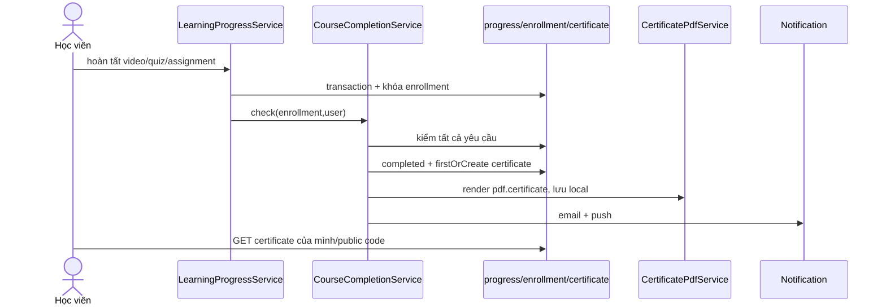
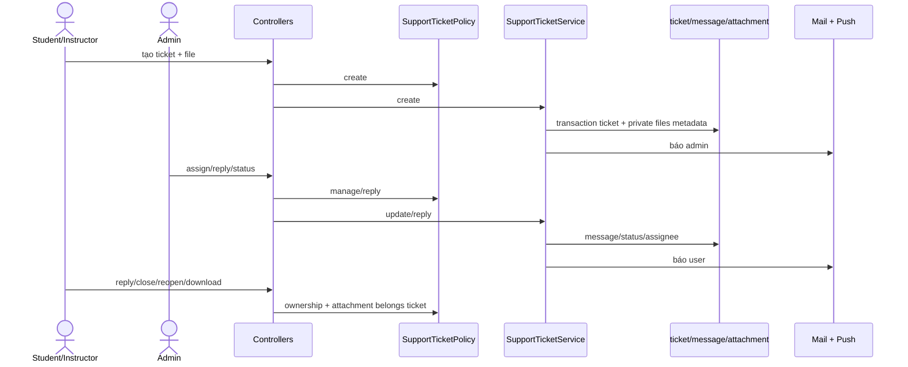

# PHÂN TÍCH CÁC CHỨC NĂNG TỰ PHỤ TRÁCH – ONLINEFEA

> Ngày rà soát: 24/08/2026. Phạm vi: repository hiện tại tại `E:\DATN`. Báo cáo dựa trên code, migration, view và test; không suy diễn từ tên file. Không đọc/ghi giá trị bí mật trong `.env`, không chạy seeder/migration trên database ứng dụng và không sửa source code.

## Mục lục

1. [Kết luận nhanh](#1-kết-luận-nhanh)
2. [Kiến trúc tổng thể](#2-kiến-trúc-tổng-thể)
3. [Đăng ký tài khoản](#3-đăng-ký-tài-khoản)
4. [Đăng nhập và đăng xuất](#4-đăng-nhập-và-đăng-xuất)
5. [Xác thực email](#5-xác-thực-email)
6. [Quên và đặt lại mật khẩu](#6-quên-và-đặt-lại-mật-khẩu)
7. [Cập nhật hồ sơ](#7-cập-nhật-hồ-sơ)
8. [Role và phân quyền](#8-role-và-phân-quyền)
9. [AI giải thích, tóm tắt và chat bài học](#9-ai-giải-thích-tóm-tắt-và-chat-bài-học)
10. [Xem và cấp chứng chỉ](#10-xem-và-cấp-chứng-chỉ)
11. [Cá nhân hóa lộ trình/gợi ý học](#11-cá-nhân-hóa-lộ-trìnhgợi-ý-học)
12. [Ticket hỗ trợ](#12-ticket-hỗ-trợ)
13. [Các file lớn, quan trọng](#13-các-file-lớn-quan-trọng)
14. [Database tổng hợp](#14-database-tổng-hợp)
15. [Bảo mật và rủi ro](#15-bảo-mật-và-rủi-ro)
16. [Kết quả test](#16-kết-quả-test)
17. [Đánh giá chất lượng](#17-đánh-giá-chất-lượng)
18. [Bộ câu hỏi bảo vệ](#18-bộ-câu-hỏi-bảo-vệ)
19. [Bài thuyết trình miệng](#19-bài-thuyết-trình-miệng)
20. [Cheat sheet](#20-cheat-sheet)

## 1. Kết luận nhanh

| # | Chức năng | Trạng thái | Kết luận có bằng chứng |
|---:|---|---|---|
| 1 | Đăng ký | Hoàn thiện một phần | Luồng học viên/giảng viên, captcha, validation, hash và OTP hoạt động; nhưng tạo user–profile–application–file không bọc transaction (`app/Services/AuthService.php:63-149`). |
| 2 | Đăng nhập | Hoàn thiện một phần | Email/username, remember, khóa tài khoản, session rotation và logout đầy đủ. Social login có code và test nhưng callback không gọi `registerActiveSession`, xung đột với single-session ở production (`SocialAuthController.php:76-95`, `SingleSessionMiddleware.php:30-58`). |
| 3 | Xác thực email | Hoàn thiện | OTP 6 số, hash, 10 phút, cooldown 60 giây, tối đa 5 lần, vô hiệu mã cũ và middleware `verified` đều có test. Link signed vẫn có route nhưng notification link riêng không được gọi. |
| 4 | Quên/đặt lại mật khẩu | Hoàn thiện | Dùng password broker Laravel, token 60 phút/throttle 60 giây, phản hồi chống dò email, đổi mật khẩu và hủy session cũ. |
| 5 | Hồ sơ | Hoàn thiện | Chỉ cập nhật trường whitelist, avatar public disk, xóa avatar cũ, đổi email bắt xác thực lại và đổi mật khẩu yêu cầu mật khẩu hiện tại. |
| 6 | Role/phân quyền | Hoàn thiện một phần | Có RBAC bảng `roles/permissions`, Gate và đồng bộ pivot; nhưng `super_admin` không nhất quán, mọi `admin` được `Gate::before` cho toàn quyền, và `CheckPermission` là code không được dùng/bị lệch API. |
| 7 | AI bài học | Hoàn thiện một phần | Gemini, fallback model, cache summary, chat history, enrollment/ownership và lỗi API đầy đủ; chưa có quota theo ngày và HTTP client tắt xác minh TLS (`GeminiService.php:152`). |
| 8 | Chứng chỉ | Hoàn thiện một phần | Cấp tự động, PDF private, email, ownership, public verification, chống trùng; nhưng quiz chỉ kiểm tra đã hoàn tất attempt, không kiểm tra điểm đạt (`CourseCompletionService.php:63-76`). |
| 9 | Cá nhân hóa lộ trình | Hoàn thiện một phần | Có hệ gợi ý hybrid thật dựa hành vi/collaborative. Tuy nhiên `learning_paths` là dữ liệu seed tĩnh trên trang chủ, không có route chi tiết hay mục tiêu/trình độ do người dùng chọn. |
| 10 | Ticket hỗ trợ | Hoàn thiện | Vòng đời, phân công admin, reply, private attachment, policy ownership, throttle và notification/email đã có test. |

## 2. Kiến trúc tổng thể

### 2.1 Công nghệ và tổ chức

- `composer.json:9-17` yêu cầu PHP `^8.3`, Laravel `^13.0`, Socialite, DomPDF, Flysystem S3, FFmpeg và Stripe. Lệnh thực tế `php artisan --version` trả về **Laravel Framework 13.16.1**.
- Frontend dùng Vite 7, Tailwind CSS 4, AlpineJS 3, Axios và Chart.js (`package.json:5-19`). Blade nằm ở `resources/views`; JavaScript chính ở `resources/js/app.js`, `learning-player.js` và một số script inline trong component.
- Đây là monolith Laravel MVC có thêm Service layer. Route web gọi middleware/Form Request/controller; controller giao nghiệp vụ phức tạp cho service; Eloquent model thao tác MySQL; Notification/Mail gửi email; Blade/JSON trả kết quả.
- Authentication không dùng Breeze/Fortify/Sanctum. Dự án tự viết controller/request/service trên guard `web` kiểu `session` và provider Eloquent (`config/auth.php:18-45,64-68`), dùng password broker chuẩn Laravel và Socialite.
- Ba vai trò vận hành thực tế là `student`, `instructor`, `admin`. `super_admin` có trong enum/schema/seed nhưng không được middleware/dashboard/service đồng bộ hỗ trợ nhất quán (`UserRole.php:7-10`; `RoleSyncService.php:11`; `User.php:382-423`).
- `.env.example` có tên biến cho DB/session/mail/AWS/OAuth/Gemini/payment; báo cáo không ghi giá trị. AI dùng `GEMINI_API_KEY`, `GEMINI_MODEL`, `GEMINI_FALLBACK_MODELS`, `GEMINI_TIMEOUT`; `.env.example` còn `OPENROUTER_API_KEY` nhưng **không tìm thấy trong luồng AI bài học hiện tại**.

### 2.2 Sơ đồ xử lý tổng quát



### 2.3 Middleware và bảo vệ nền tảng

| Middleware/cơ chế | Vai trò | Bằng chứng |
|---|---|---|
| `auth` | Yêu cầu đăng nhập bằng session guard | `config/auth.php:40-45`; các group tại `routes/web.php:92,194,212...` |
| `active` | Logout và hủy session nếu `is_active=false` | `EnsureAccountIsActive.php:12-26` |
| `verified` | Dùng Laravel base middleware, có thể tắt bằng config | `EnsureEmailIsVerified.php:10-16` |
| `2fa` | Yêu cầu session có `two_factor_passed_at` | `EnsureTwoFactorIsVerified.php:11-19` |
| `role` | So sánh trực tiếp `users.role` với danh sách route | `CheckRole.php:11-28` |
| `single.session` | Chỉ giữ active session đã đăng ký | `bootstrap/app.php:31,34`; `SingleSessionMiddleware.php:19-70` |
| CSRF | Mặc định cho web; chỉ loại trừ payment IPN và multipart S3 | `bootstrap/app.php:20-23` |
| Gate động | Tạo Gate từ từng slug permission; admin bypass tất cả | `AppServiceProvider.php:40-46` |

### 2.4 Framework cung cấp và code nhóm tự viết

| Laravel/framework | Code nhóm |
|---|---|
| Session guard, `Auth::attempt`, password broker/token hashing, CSRF, signed URL, route-model binding, validation, Eloquent, notification, rate limiter | `AuthController/AuthService`, captcha, OTP hash/cooldown/attempt, single-session, RBAC sync, Gemini prompt/fallback/cache, certificate eligibility/PDF, hybrid recommendation, ticket lifecycle/policy |

## 3. Đăng ký tài khoản

### A. Mục đích nghiệp vụ

- Actor công khai chọn học viên hoặc giảng viên. Chỉ hai role này được route chấp nhận (`routes/web.php:171-172`, `AuthController.php:105`). Request không được tự gửi `role` (`RegisterRequest.php:28`; `RegisterInstructorRequest.php:37`).
- Học viên nhập tên, email, điện thoại, mật khẩu/xác nhận, đồng ý điều khoản và captcha. Giảng viên thêm chuyên môn, kinh nghiệm, bio, URL tùy chọn, CV/chứng chỉ tùy chọn và hai cam kết (`RegisterRequest.php:20-31`; `RegisterInstructorRequest.php:20-40`).
- Email/phone unique, password tối thiểu 8 ký tự gồm hoa/thường/số/ký hiệu. Trạng thái mặc định `is_active=true`; instructor là `pending` và cần admin review (`AuthService.php:65-78`).
- Sau thành công user được login, rotate session, đăng ký active session rồi nhận OTP nếu xác thực email bật (`AuthController.php:118-148`).

### B. Luồng chính và truy vết end-to-end



`resources/views/auth/register-role.blade.php` → `routes/web.php:170-172` → `guest`, `throttle:6,1` → `RegisterRequest::rules` hoặc `RegisterInstructorRequest::rules` → `AuthController::register` (`99-149`) → `AuthService::register` (`63-149`) → `User`, `InstructorProfile`, `InstructorApplication`, `InstructorCertificate` → các bảng tương ứng → `Registered` → `User::sendEmailVerificationNotification` (`User.php:178-181`) → `EmailVerificationService::sendCode` → `verification.notice`.

### C. Ngoại lệ

- Role ngoài student/instructor: 404 (`AuthController.php:105`). Trùng email/phone và password yếu: validation 422/quay lại form.
- Captcha sai/hết hạn: `ValidationException` (`RegisterRequest.php:75-81`). Gửi mail OTP lỗi: user vẫn đã tạo và đăng nhập, controller ghi log rồi chuyển trang verify với lỗi thân thiện (`AuthController.php:129-148`).
- Upload instructor được giới hạn PDF hoặc ảnh, 5 MB; lưu CV ở public nhưng chứng chỉ ở local private (`RegisterInstructorRequest.php:33-34`; `AuthService.php:81-106`).
- Rủi ro nhất: không có `DB::transaction`; lỗi sau khi tạo user có thể để user thiếu profile/application, file đã lưu không được rollback.

### D. File liên quan

| STT | File | Class/method | Vai trò | Gọi từ | Tác động dữ liệu |
|---:|---|---|---|---|---|
| 1 | `routes/web.php:167-186` | guest routes | Form/submit/social | Browser | Không |
| 2 | `app/Http/Controllers/Web/AuthController.php:84-149` | `showRegister*`, `register` | Điều phối | Route | Login/session |
| 3 | `app/Http/Requests/Auth/RegisterRequest.php` | `rules`, `validateCaptcha` | Validate student | Controller | Không |
| 4 | `app/Http/Requests/Auth/RegisterInstructorRequest.php` | `rules` | Validate instructor/file | Controller | Không |
| 5 | `app/Services/AuthService.php:63-149` | `register` | Tạo account/hồ sơ | Controller | Ghi 1–4 bảng/file |
| 6 | `app/Models/User.php:22-38,198-204` | fillable/cast/event | Hash password, sync role | Service/Eloquent | `users`, `role_user` |
| 7 | `resources/views/auth/register-role.blade.php` | Blade form | UI | GET register role | POST form + CSRF |
| 8 | `tests/Feature/AuthenticationTest.php:33-237` | 13 test đăng ký | Chứng minh flow | PHPUnit | Test DB |

### E. Dữ liệu

| Bảng | Cột chính/FK | Đọc/ghi |
|---|---|---|
| `users` | unique email/phone/username; role, `is_active`, `email_verified_at` | Tạo account; password cast `hashed` |
| `role_user` | PK kép role_id+user_id | Event `saved` đồng bộ primary role |
| `instructor_profiles` | user_id | Ghi thông tin nghề nghiệp |
| `instructor_applications` | user_id, status | Tạo đơn pending |
| `instructor_certificates` | user_id, private file metadata | Tạo nếu upload |
| `email_verification_codes` | user_id FK; hash/expiry/attempt | Tạo OTP |
| `active_sessions`, `sessions` | user_id/session_id | Ghi phiên đăng nhập |

`users` dùng soft delete (`User.php:17,38`; migration `2026_06_27...:44-46`). Unique ở cả validation và DB giảm race trùng email/phone. Username được dò tăng suffix nhưng không transaction; unique DB là lớp cuối.

### F/G. Bảo mật và mức hoàn thiện

- Tốt: whitelist validated data, cấm role trong payload, CSRF mặc định, captcha, throttle route, password hash bằng cast, session regeneration và unique DB.
- Cần cải thiện: transaction + cleanup file; không log email nguyên văn khi mail OTP fail (`AuthController.php:136-139`); CV nằm public trong khi giấy tờ nên private.
- **Trạng thái: Hoàn thiện một phần** vì luồng hoạt động và test pass nhưng tính nguyên tử khi đăng ký giảng viên chưa bảo đảm.

## 4. Đăng nhập và đăng xuất

### A/B. Nghiệp vụ, luồng và truy vết

- Đăng nhập bằng email hoặc username, password, remember và captcha; tối đa 5 lần theo `identifier|IP`. Sai thông tin trả cùng thông báo để hạn chế dò tài khoản (`AuthService.php:17-42`).
- Kiểm tra `is_active`, rotate session, cập nhật IP/thời điểm, ghi activity log và redirect theo role (`AuthService.php:43-57`; `User.php:410-423`). Logout chỉ POST, invalidate session và regenerate CSRF token (`AuthController.php:151-159`).



`auth/login.blade.php` → `routes/web.php:168-169` (`guest`, `throttle:5,1`) → `LoginRequest::rules/ensureIsNotRateLimited/validateCaptcha` → `AuthController::login` (`60-82`) → `AuthService::login` (`17-58`) → `users`, `sessions`, `active_sessions`, `activity_logs` → dashboard/2FA. Logout: form POST → `routes/web.php:192` → `AuthController::logout`.

Social: `/auth/{google|facebook}/redirect` → `SocialAuthController::redirect/callback` → Socialite OAuth → `SocialAuthService::resolveUser` transaction → `users` + `social_accounts` → `Auth::login(..., true)` → dashboard. Provider khác không được route nhận. Config có GitHub/Microsoft nhưng route chỉ cho Google/Facebook (`routes/web.php:175-180`; `config/services.php:38-65`).

### C. Ngoại lệ và bảo mật

- Sai password/identifier cùng một lỗi; inactive bị logout; soft-deleted không được provider Eloquent tìm thấy. RateLimiter và route throttle cùng bảo vệ brute force; captcha là lớp bổ sung.
- Social callback xử lý user hủy, invalid state, thiếu email, provider chưa cấu hình, account bị khóa và liên kết provider trùng (`SocialAuthController.php:49-74`; `SocialAuthService.php:16-76,136-180`). DB transaction và unique provider ID chống race.
- **Nghiêm trọng:** callback social rotate session nhưng không gọi `AuthService::registerActiveSession`. Ở production, request kế tiếp đi qua `SingleSessionMiddleware`, không tìm thấy active session và logout (`SocialAuthController.php:76-95`; `SingleSessionMiddleware.php:30-58`). Test không phát hiện vì middleware bỏ qua khi `testing` (`SingleSessionMiddleware.php:21`).

### D/E. File và dữ liệu

| File | Method | Vai trò | Dữ liệu |
|---|---|---|---|
| `LoginRequest.php:21-80` | rules/rate/captcha | Validate và khóa brute force | RateLimiter/cache |
| `AuthController.php:47-82,151-160,422-444` | login/logout/redirect | Điều phối, chống open redirect | session/log |
| `AuthService.php:17-58,183-244` | login/registerActiveSession | Auth, single session | users/active_sessions |
| `SocialAuthController.php:22-101` | redirect/callback | OAuth web flow | session/users |
| `SocialAuthService.php:16-180` | resolve/link | Liên kết account trong transaction | users/social_accounts |
| `tests/Feature/AuthenticationTest.php:238-432` | login/logout tests | 12 test | Test DB |
| `tests/Feature/SocialAuthenticationTest.php` | 18 test | OAuth/linking | Test DB |

`social_accounts` unique `(provider, provider_user_id)` và index `(user_id, provider)` (`2026_07_09_000005...:11-21`). `sessions` lưu session guard; `active_sessions.session_id` unique (`2026_07_21_042546...:14-47`).

### G. Mức hoàn thiện

**Hoàn thiện một phần.** Đăng nhập thường hoàn thiện; social login có code và test nhưng lỗi tích hợp single-session cần được trình bày trung thực.

## 5. Xác thực email

### A/B. Nghiệp vụ và luồng

- Luồng vận hành là OTP 6 số, không phải link mặc định. `Registered` gọi method override trên User, từ đó gọi `EmailVerificationService::sendCode` (`User.php:178-181`). `VerifyEmailNotification` dạng link có code nhưng **không tìm thấy nơi gọi**; signed route vẫn tồn tại (`routes/web.php:199-201`).
- OTP sinh bằng `random_int`, lưu `Hash::make`, hạn 10 phút; code mới vô hiệu code cũ; tối đa 5 lần sai; resend cooldown 60 giây và route throttle 5 lần/15 phút (`EmailVerificationCode.php:10-14`; `EmailVerificationService.php:27-56,89-117,142-153`).

```mermaid
sequenceDiagram
    actor U
    participant C as AuthController
    participant S as EmailVerificationService
    participant DB as email_verification_codes/users
    participant N as VerifyEmailCodeNotification
    U->>C: đăng ký hoặc POST resend
    C->>S: sendCode(user)
    S->>DB: vô hiệu mã cũ, lưu hash + expiry
    S->>N: gửi OTP plaintext qua mail
    U->>C: POST /email/verify-code
    C->>S: verify(user, code)
    S->>DB: tăng attempt hoặc used_at; email_verified_at
    C-->>U: dashboard theo role
```

Trace: `auth/verify-email.blade.php` → `routes/web.php:194-206` (`auth`,`active`, signed/throttle tùy route) → `VerifyEmailCodeRequest::rules` → `AuthController::verifyEmailCode/resendVerification` (`295-357`) → `EmailVerificationService` → `email_verification_codes/users` → `VerifyEmailCodeNotification` → redirect dashboard.

### C. Ngoại lệ

- Sai format: validation 6 digits. Sai code: tăng count; lần 5 set `used_at`. Hết hạn hoặc dùng rồi: từ chối. Code user khác không thể dùng vì query luôn scope `user_id`.
- Resend sớm: validation lỗi kèm thời gian còn lại. Mail fail: log và thông báo thân thiện. `instantVerify` chỉ tồn tại ngoài production (`AuthController.php:360-373`).
- User chưa verify bị chặn ở AI, dashboard, student/admin/support và nhiều route group có `verified`; instructor profile cơ bản cố ý không có `verified` để hoàn thiện hồ sơ (`routes/web.php:212-240,244-278,281-299,324-360,364-452`).

### D/E/F/G

| File/bảng | Vai trò | Điểm bảo mật |
|---|---|---|
| `EmailVerificationService.php` | Sinh/gửi/xác minh/vô hiệu OTP | hash, expiry, attempt, scope user |
| `EmailVerificationCode.php` | Constants/casts | 5 lần, 10 phút, 60 giây |
| `VerifyEmailCodeRequest.php` | 6 chữ số, phải login | authorize user khác null |
| `VerifyEmailCodeNotification.php` | Email OTP | Queueable nhưng không implements ShouldQueue, nên gửi đồng bộ |
| migration `2026_07_11...` | Schema | FK cascade, index user+expiry |
| `EmailVerificationTest.php` | 25 test | Bao phủ code sai/hết hạn/reuse/user khác/middleware |

Không soft-delete code; code được đánh dấu used. Không transaction giữa `used_at` và `markEmailAsVerified`, nên lỗi hiếm có thể tiêu code trước khi verify user. **Trạng thái: Hoàn thiện**; điểm cải thiện là transaction và xóa/retention code cũ.

## 6. Quên và đặt lại mật khẩu

### A/B. Luồng



Trace: `auth/forgot-password.blade.php` → `routes/web.php:173-174` (`guest`,`throttle:10,1`) → `ForgotPasswordRequest` + captcha → `AuthController::sendResetLink` (`184-220`) → Laravel `Password::broker('users')` → `password_reset_tokens` → `User::sendPasswordResetNotification` → `ResetPasswordNotification`. Reset: `auth/reset-password.blade.php` → routes `188-189` → `ResetPasswordRequest` → `AuthController::resetPassword` (`230-269`) → broker → `users/sessions` → login.

### C. Quy tắc/ngoại lệ

- Token ở `password_reset_tokens`, expire 60 phút và broker throttle 60 giây (`config/auth.php:95-101`; migration base `54-58`). Laravel broker hash token và xóa sau reset thành công.
- Email không tồn tại nhận cùng thông báo neutral để chống enumeration (`AuthController.php:188-219`). SMTP lỗi được catch, log email masked và trả lỗi thân thiện.
- Password mới có cùng rule mạnh; invalid/expired/used token đều không reset. Sau thành công rotate `remember_token`, xóa DB sessions bằng `DatabaseSessionInvalidator`, logout session hiện tại (`AuthController.php:234-254`).
- Account khóa vẫn được reset nhưng không login được; test xác nhận (`PasswordResetTest.php:318`).

### D/E/F/G

| File | Method | Vai trò/data |
|---|---|---|
| `AuthController.php:177-269` | send/show/reset | Broker, lỗi, session invalidation |
| `ForgotPasswordRequest.php` | rules/captcha | email RFC + captcha |
| `ResetPasswordRequest.php` | rules | token/email/password mạnh |
| `ResetPasswordNotification.php` | toMail | Link và expiry từ config |
| `DatabaseSessionInvalidator.php` | invalidateForUser | Xóa sessions theo user_id |
| `config/auth.php:95-101` | broker config | table/expire/throttle |
| `PasswordResetTest.php` | 17 test | token, mail, hash, reuse, sessions |

CSRF áp dụng; SQL injection được Eloquent/broker parameter binding; mass assignment không dùng payload thô. POST reset chưa có route throttle riêng, nhưng token có entropy/expiry và broker xử lý; có thể thêm throttle để defense-in-depth. **Trạng thái: Hoàn thiện.**

## 7. Cập nhật hồ sơ

### A/B. Nghiệp vụ và luồng

- User chỉ sửa avatar, name, username, phone, bio và thông tin ngân hàng qua `ProfileController::update`; email/password có endpoint riêng. Controller luôn lấy `$request->user()`, không nhận user ID nên chống IDOR.
- Avatar JPG/JPEG/PNG/WebP tối đa 2 MB, lưu `avatars` trên public disk; xóa file cũ nếu không phải URL (`ProfileController.php:56-83`; `AuthService.php:152-157`).
- Đổi email yêu cầu current password, unique, đặt `email_verified_at=null`, vô hiệu OTP cũ và gửi OTP mới (`ProfileController.php:89-121`).



Trace: `resources/views/student/profile.blade.php` / `admin/profile/show.blade.php` → `routes/web.php:212-220,275-277` (`auth`,`active`,`verified`,`2fa` cho group chính) → validation nội tuyến → `ProfileController::update/updateEmail/updatePassword` → `AuthService`/`EmailVerificationService` → `users`, public storage, OTP → redirect.

### C/D/E/F/G

| File | Method | Vai trò | Dữ liệu |
|---|---|---|---|
| `ProfileController.php:25-208` | show/update/email/password/2FA/sessions | Tất cả thao tác hồ sơ chung | users/sessions/logs/files |
| `AuthService.php:152-157` | deleteAvatar | Xóa avatar local cũ | public disk |
| `User.php:22-34,237-257` | fillable/hidden/casts | Hash và chống lộ field | users |
| `student/profile.blade.php` | forms | UI + CSRF | PUT/DELETE/POST |
| `InstructorProfileController.php` | update/uploadDocument | Hồ sơ riêng instructor | profile/doc private |
| `InstructorProfileAvatarTest.php` | avatar test | Route instructor chưa verify | Test DB |

- Mass assignment được hạn chế bằng `$validated`; request không chứa role/status. `users` model có role trong fillable nhưng endpoint hồ sơ không validate/merge role, nên user không tự nâng quyền qua route này.
- XSS: Blade `{{ }}` escape output; bio lưu text. Upload kiểm MIME/extension/size nhưng public image vẫn nên re-encode/scan. Xóa avatar cũ xảy ra trước `$user->update`, có rủi ro nhỏ mất ảnh cũ nếu update DB lỗi.
- Route `student/profile` gọi cùng update an toàn. Instructor có controller riêng và cố ý truy cập khi chưa verify để hoàn tất hồ sơ.
- **Trạng thái: Hoàn thiện.** Thiếu test sâu cho email-change, avatar replacement/delete failure và field role injection.

## 8. Role và phân quyền

### A. Mô hình nghiệp vụ thực tế

- Dự án dùng **hai lớp role song song**: cột chính `users.role` điều khiển middleware/dashboard và quan hệ nhiều-nhiều `role_user` phục vụ permission động (`User.php:188-204,397-407`). `RoleSyncService` đồng bộ ba role chính student/instructor/admin.
- `roles`, `permissions`, `permission_role`, `role_user` có PK/unique/FK cascade (`2026_06_27_000002...:12-38`). Role hệ thống không được đổi slug hoặc xóa; role đang có user cũng không được xóa (`RoleController.php:103-142`).
- Route role nằm trong group `role:admin`; controller kiểm thêm Gate `roles.view/create/update/delete`. Tuy nhiên `Gate::before` trả true cho mọi user có `role==='admin'`, vì vậy permission chi tiết không hạn chế admin (`AppServiceProvider.php:40`).

### B. Luồng quản lý



Trace: `admin/roles/*.blade.php` → `routes/web.php:364,377-382` → middleware group → `StoreRoleRequest`/`UpdateRoleRequest` → `RoleController` → `Gate` động → `Role/Permission` → bốn bảng RBAC → redirect/view.

### C. Ngoại lệ và lệch thiết kế

- Duplicate name/slug và permission ID giả bị validation chặn. Xóa role system hoặc role có user bị từ chối. Transaction bảo đảm role và permission sync đồng bộ (`RoleController.php:71-82,109-121`).
- User public không thể tự gửi role lúc đăng ký; route admin update chỉ chấp nhận student/instructor/admin. Admin không thể tự khóa/hạ chính mình (`UpdateUserRequest.php:17-43,55-76`).
- **Super Admin chưa hoàn thiện:** enum/schema/seed có `super_admin`, nhưng `User::isAdmin()` chỉ nhận `admin`; không có `isSuperAdmin()` dù `CheckPermission` gọi nó; `CheckPermission` còn gọi `Permission::roleHas()` không tồn tại và middleware này không được alias/route sử dụng. `RoleSyncService::PRIMARY_ROLE_SLUGS` cũng thiếu super_admin. Vì vậy đây là **có code nhưng chưa được sử dụng/không nhất quán**.
- Không có rule ngăn admin thường sửa permission của role hệ thống/super_admin. Update chỉ khóa slug, vẫn sync toàn bộ permissions (`RoleController.php:115-120`).

### D. File liên quan

| STT | File | Class/method | Vai trò | Dữ liệu |
|---:|---|---|---|---|
| 1 | `routes/web.php:364-382` | admin role routes | Entry + middleware | Không |
| 2 | `RoleController.php:42-186` | CRUD/group permissions | Nghiệp vụ | roles/pivots |
| 3 | `StoreRoleRequest.php`, `UpdateRoleRequest.php` | rules/prepare | Validate | Không |
| 4 | `User.php:188-204,397-407` | roles/sync/hasPermissionTo | Quyền user | role_user |
| 5 | `RoleSyncService.php` | ensure/syncPrimaryRole | Đồng bộ cột và pivot | roles/role_user |
| 6 | `AppServiceProvider.php:40-46` | Gate before/dynamic | Authorization | permissions |
| 7 | `RolePolicy.php` | view/create/update/delete | Policy có code | Không được controller gọi theo model ability; controller gọi slug Gate |
| 8 | `CheckPermission.php` | handle | Middleware permission cũ | Có code nhưng chưa dùng, API lỗi |
| 9 | `PermissionSeeder.php` | run | Seed một phần permission/super admin | roles/permissions |
| 10 | `RoleAndMiddlewareTest.php` | 22 test | CRUD/middleware/sync | Test DB |

### E/F/G. Dữ liệu, bảo mật, trạng thái

| Bảng | Khóa bảo vệ | Rủi ro |
|---|---|---|
| `roles` | slug unique | name chỉ validation unique; migration đầu không unique name |
| `permissions` | slug unique | Gate được tạo lúc boot từ DB |
| `permission_role` | PK kép, FK cascade | sync trong transaction |
| `role_user` | PK kép, FK cascade | cột users.role và pivot có thể lệch nếu ghi DB trực tiếp, dù model event xử lý Eloquent save |

Authentication/role middleware chặn user ngoài admin. CSRF và Form Request bảo vệ input. Tuy nhiên authorization permission chi tiết bị admin bypass và không có bảo vệ Super Admin thực tế. **Trạng thái: Hoàn thiện một phần.**

## 9. AI giải thích, tóm tắt và chat bài học

### A. Nghiệp vụ và actor

- UI nằm trong trang bài học: tab summary/explain và floating AI assistant (`courses/lesson.blade.php:196-214`; `components/learning/ai-study-assistant.blade.php:9-79`).
- Admin được dùng; instructor chỉ dùng với khóa mình sở hữu; student phải có enrollment active/completed. Lesson phải thực sự thuộc course (`LessonAiService.php:24-51,539-550`).
- Tóm tắt chỉ dùng content hoặc transcript/phụ đề đủ dài, không tự tải video, lưu cache một bản/lesson theo source hash. Explain/chat có thể dùng kiến thức chung; chat lưu lịch sử theo user–course–lesson.

### B. Luồng chính



Trace: lesson Blade/JS → `routes/web.php:140-152` (`auth`,`active`,`verified`, throttle group + endpoint) → `ExplainLessonRequest`/`ChatLessonRequest` → `LessonAiController::summary/explain/chat/history` → `LessonAiService` → `LessonContextService` → `Ai\GeminiService` → Google Gemini REST → `lesson_ai_summaries`, `ai_conversations`, `ai_chat_messages` → JSON.

### C. Phân biệt và xử lý lỗi

- Summary prompt buộc JSON gồm summary/key_points/takeaways và chỉ dùng context (`LessonAiService.php:368-383`). Source hash SHA-256 làm cache invalid khi nội dung thay đổi.
- Explain prompt nhận question tối đa 1000 ký tự, ưu tiên context nhưng cho kiến thức chung (`386-403`). Chat tối đa 2000 ký tự, lấy 20 message gần nhất và kiểm ownership conversation (`409-500`).
- Provider/model: Google Gemini; model/env ở `config/services.php:73-87`. `GeminiService` thử primary và fallback cho invalid model/quota/unavailable (`21-87`). Missing key, invalid key/model, quota, blocked content, empty, max token, timeout/DNS/SSL đều map thành JSON/status thân thiện (`LessonAiService.php:510-535`; `GeminiService.php:240-407`).
- Route limit hiệu dụng: summary 6/phút, explain 10/phút, chat 20/phút (endpoint cụ thể chặt hơn hoặc bằng group). **Không tìm thấy giới hạn theo ngày/user hoặc bảng quota sử dụng.**
- Prompt injection chỉ được giảm bằng chỉ thị không lộ prompt/secret, giới hạn context, loại quiz answer và sanitize output; không có classifier/structured isolation chắc chắn. Context có nội dung course do instructor tạo nên vẫn là dữ liệu không tin cậy.
- Summary và chat được lưu; explain đơn lẻ không lưu. Khi AI lỗi không có nội dung fallback, chỉ trả thông báo/fallback model.

### D/E. File và database

| File | Method | Vai trò | Tác động |
|---|---|---|---|
| `LessonAiController.php` | 4 endpoint | Điều phối JSON/error | Không trực tiếp |
| `LessonAiService.php` | auth, summary, explain, chat, prompts | Core nghiệp vụ | AI tables |
| `LessonContextService.php` | build/hash/subtitle | Tạo context 12.000 ký tự, không quiz | lessons/subtitle files |
| `Ai/GeminiService.php` | generateText/requestModel | HTTP/fallback/error map | External API |
| `ExplainLessonRequest.php`, `ChatLessonRequest.php` | rules | Validation JSON | Không |
| `LessonAiSummary.php` | model | Cache summary | lesson_ai_summaries |
| `AiConversation.php`, `AiChatMessage.php` | models | Scope/lịch sử | ai_conversations/ai_chat_messages |
| `LessonAiTest.php` | 30 test | Auth/cache/errors/leak/history | Test DB/fake provider |

| Bảng | Ràng buộc | Khi ghi |
|---|---|---|
| `lesson_ai_summaries` | lesson_id FK unique, source_hash | generate summary/update source |
| `ai_conversations` | unique user+course+lesson | chat đầu tiên |
| `ai_chat_messages` | FK conversation/user/lesson | mỗi user/assistant message |
| `enrollments` | unique user+course | chỉ đọc quyền truy cập |

### F/G. Bảo mật và trạng thái

- Tốt: auth/verified, kiểm enrollment/owner, chống lesson mismatch/IDOR conversation, route throttle, không đưa quiz answer, output strip HTML, không log prompt/API key, config lấy từ env.
- **Nghiêm trọng:** `Http::withoutVerifying()` tắt xác minh chứng chỉ TLS (`GeminiService.php:152-159`), làm yếu bảo mật API key/nội dung trước MITM.
- Trung bình: không quota ngày/chi phí; user message được ghi trước khi provider thành công nên lỗi AI để lại message user không có cặp assistant (`LessonAiService.php:164-180`); prompt injection chỉ dựa instruction.
- **Trạng thái: Hoàn thiện một phần** dù 30 test pass, vì TLS và quản trị quota là thiếu sót vận hành quan trọng.

## 10. Xem và cấp chứng chỉ

### A. Điều kiện và nghiệp vụ

- `CourseCompletionService::check` lấy mọi lesson required/published. Video cần `LessonProgress.is_completed`; quiz cần một attempt có `completed_at`; assignment cần submission graded và score >= passing score (`36-98`). Enrollment phải active/completed.
- Khi đủ điều kiện lần đầu: set enrollment completed, cộng điểm, `firstOrCreate` certificate, sinh PDF, gửi email và push. Chỉ cấp nếu `course.certificate_enabled` (`101-171`).
- Mã dạng `FEA-` + 8 ký tự random uppercase; DB unique code và unique user–course chống trùng (`CourseCompletionService.php:153-159`; migration certificate `18-25`).

### B. Luồng chính



Trace cấp: progress API/controller → `LearningProgressService::recordLessonProgress/refreshCourseProgress` (`24-115,269-306`) → `CourseCompletionService::check` → `lesson_progress`, `quiz_attempts`, `submissions`, `enrollments`, `certificates` → `CertificatePdfService`/`CertificateIssuedNotification` → list certificate. Trace xem: `student/certificates.blade.php` → `routes/web.php:271-272` → `MiscController::certificates/viewCertificatePdf` → owner check → local PDF/DOMPDF. Public verify: `routes/web.php:90-91` → query unique code → HTML/PDF.

### C. Ngoại lệ và vấn đề nghiệp vụ

- Chưa đủ lesson/enrollment access: không issue và trả `missing_requirements`. Certificate disabled: hoàn thành course nhưng không tạo certificate. Email/PDF lỗi được log; issue vẫn giữ.
- Owner route chặn user A xem PDF user B (`MiscController.php:210-238`). Public route cố ý không cần auth và dùng code khó đoán; đây là verification public, đồng nghĩa ai có code xem được tên/course.
- **Sai lệch trung bình/cao:** comment và message nói quiz “đạt điểm”, nhưng query chỉ cần `completed_at`, không so `score` với passing score (`CourseCompletionService.php:63-76`). Một bài quiz trượt vẫn có thể đạt điều kiện certificate.
- Mã random không có retry khi va chạm unique code; xác suất thấp nhưng có thể làm transaction fail. `firstOrCreate` + unique user/course chống duplicate tốt.
- Progress path bọc transaction và lock enrollment (`LearningProgressService.php:24-30`), nên phần issue được gọi bên trong transaction. Notification email được catch; PDF `ensureStored` cũng catch. Push create không catch trong `check`, nên lỗi push có thể rollback transaction nhưng file PDF trên disk không rollback.

### D/E/F/G

| File | Method | Vai trò | Dữ liệu |
|---|---|---|---|
| `LearningProgressService.php` | record/refresh | Tính % required lessons, trigger check | progress/enrollment |
| `CourseCompletionService.php` | check/issueCertificate | Eligibility + issue | attempts/submissions/certificates |
| `CertificatePdfService.php` | store/ensure/absolutePath | PDF private local | file_path/local disk |
| `MiscController.php:96-133,210-285` | list/resend/view/public | Delivery/ownership | certificate |
| `CertificateIssuedNotification.php` | toMail | Email + attach PDF | Mail |
| `pdf/certificate.blade.php` | template | Render HTML/PDF | escaped model data |
| `CertificateEligibilityTest.php` | 8 test | Eligibility/duplicate/view/mail fail | Test DB |

`certificates` không soft delete; FK cascade xóa cùng user/course. PDF ở `local`, chỉ controller authorized/public code trả file. **Trạng thái: Hoàn thiện một phần** vì bug passing score của quiz và thiếu test assignment/public verification/IDOR PDF trực tiếp.

## 11. Cá nhân hóa lộ trình/gợi ý học

### A. Logic thực tế so với tên chức năng

- Có **hai khái niệm khác nhau**:
  - `learning_paths`: hai lộ trình seed sẵn, homepage chỉ `LearningPath::limit(3)->get()`. Không có route chi tiết, không relation `courses()` trong model, không user_path, không form chọn mục tiêu/sở thích (`HomeController.php:87`; `LearningPath.php:7-15`; `LearningPathSeeder.php:14-66`). Đây là hiển thị tĩnh, chưa cá nhân hóa.
  - `CourseRecommendationService`: hệ gợi ý course hybrid thật trên trang chi tiết khóa. Đây mới là phần “dành cho bạn”.
- User không trực tiếp chọn mục tiêu/trình độ/sở thích. Hệ thống suy ra từ viewed courses, enrollments, paid orders, wishlists, reviews, category/tag/instructor/level/price và hành vi user tương tự (`CourseRecommendationService.php:165-419`).

### B. Luồng recommendation

```mermaid
flowchart LR
    U[User mở courses/{slug}] --> C[CourseController::show]
    C --> S[CourseRecommendationService]
    S --> P[Build preference profile]
    P --> D[(recent views, enrollments, orders, wishlists, reviews)]
    P --> CF[Collaborative filtering]
    S --> Q[Published candidate query]
    Q --> SC[Rule-based weighted scoring]
    SC --> EX[Loại current + owned]
    EX --> CA[Cache ID 30 phút + fingerprint]
    CA --> V[courses/show.blade.php: Đề xuất dành cho bạn]
```

Trace: `GET /courses/{slug}` (`routes/web.php:165`) → `CourseController::show` (`45-86`) → `CourseRecommendationService::getRelatedCourses/getPersonalizedRecommendations` (`25-113`) → các model/tables hành vi → rank/cache → `resources/views/courses/show.blade.php`. Không có AI provider trong thuật toán.

### C. Quy tắc, fallback và ngoại lệ

- Rule-based + DB collaborative: trọng số theo recency; đánh giá >=4 boost, <=2 tạo penalty; similar users từ overlap enrollment/wishlist; quality thêm rating/popularity/freshness/discount (`CourseRecommendationService.php:222-419,663-857`).
- Loại course hiện tại và course đã sở hữu (`877-882`); course hoàn thành nằm trong enrollment access nên cũng bị loại. Wishlist chưa mua có thể vừa là signal vừa vẫn được đề xuất.
- Guest/new user dùng cold start theo current course và quality; thiếu candidate thì fallback theo category/level/tags/popularity. Chỉ query course published (`baseCandidateQuery`, khoảng `613-643`).
- Cache 30 phút; key có fingerprint theo thay đổi signal, chỉ cache ID an toàn, tự phục hồi payload cũ lỗi (`19,37-87,887-...`).
- `learning_path_courses` có unique path+course nhưng seeder dùng `insert` cố định và không `upsert`; chạy seeder lại có nguy cơ duplicate/PK conflict. Không có luồng user thêm course vào path.

### D/E/F/G

| File/bảng | Vai trò | Trạng thái sử dụng |
|---|---|---|
| `CourseRecommendationService.php` | 1.181 dòng: profile, candidate, scoring, collaborative, cache | Được `CourseController` gọi |
| `CourseController.php:45-86` | Gọi service và chọn nhãn personalized | Được route public gọi |
| `recently_viewed_courses`, `enrollments`, `orders/order_items`, `wishlists`, `reviews` | Tín hiệu hành vi | Chỉ đọc |
| `courses/categories` | Candidate/metadata | Chỉ đọc published |
| `LearningPath.php` + two migrations | Catalog path tĩnh + pivot | Chỉ homepage đọc path; pivot không được controller dùng |
| `LearningPathSeeder.php` | Dữ liệu mẫu cố định | Chỉ khi seed |
| `RelatedCoursesTest.php` | 13 test | Scoring, cold start, cache, query count |

Không ghi profile nhạy cảm mới; dùng dữ liệu nội bộ của đúng user. Không có endpoint nhận ID tùy ý nên IDOR không đáng kể. Cần giải thích minh bạch lý do gợi ý; service đã gắn `recommendation_reason`. **Trạng thái: Hoàn thiện một phần**: recommendation cá nhân hóa hoàn thiện tốt, nhưng “lộ trình học cá nhân hóa” theo bảng `learning_paths` chưa có.

## 12. Ticket hỗ trợ

### A. Nghiệp vụ

- Student và instructor active/verified/2FA có thể tạo; admin quản trị. Trường: subject, message, category, priority tùy chọn, tối đa 5 attachment mỗi file 5 MB (`StoreSupportTicketRequest.php:20-29`).
- Code `TK-{year}-{8 random uppercase}` với tối đa 20 lần kiểm tra rồi fallback 12 ký tự; DB unique (`SupportTicketService.php:192-204`; migration enhance `81-88`).
- Status: open → in_progress → resolved/closed; priority low/medium/high; admin có thể assign admin active. User close và reopen resolved/closed; reply user bị chặn khi closed.

### B. Luồng vòng đời



Trace user: support Blade → `routes/web.php:232-240` (`auth`,`active`,`verified`,`2fa`,`role:student,instructor`, throttle store/reply) → Store/Reply Request (authorize policy + validate) → `SupportTicketController` → `SupportTicketService` → ticket/message/attachment tables → notification/push → redirect. Admin tương tự qua `routes/web.php:364,444-448` và admin controller.

### C. Ngoại lệ và an toàn

- User khác xem/download bị policy từ chối; controller kiểm thêm attachment.ticket_id để chống parameter mixing (`SupportTicketPolicy.php:16-27,72-79`; controllers download).
- Dangerous/oversize file bị MIME allowlist chặn; file lưu disk `local` private, download qua controller. Original name chỉ dùng Content-Disposition; framework xử lý response.
- Transaction bao ticket/message + metadata. Tuy nhiên filesystem không transaction; upload từng file catch và bỏ qua lỗi nên ticket/reply vẫn thành công, có thể file đã lưu nhưng metadata create lỗi tạo orphan (`SupportTicketService.php:209-238`).
- Email/push failure được catch, không rollback nghiệp vụ. User không thể assign/resolve vì không có route và admin request policy kiểm `manage`.
- Throttle: create 10/phút, reply user 20/phút, reply admin 30/phút. Không CAPTCHA ticket; mức này là chống spam cơ bản.
- Blade dùng escaped echo cho subject/message, giảm stored XSS; không cho HTML upload, nhưng ZIP/DOC vẫn nên antivirus scan.

### D/E/F/G

| File | Method | Vai trò | Dữ liệu |
|---|---|---|---|
| User/Admin `SupportTicketController` | CRUD flow | Điều phối + policy | ticket/messages/files |
| `SupportTicketService.php` | create/reply/status/assign/code/notify | Nghiệp vụ | 4 bảng + local disk/mail |
| 3 Form Requests | authorize/rules | Ownership/validation | Không |
| `SupportTicketPolicy.php` | 8 abilities | Chống IDOR/quyền | Không |
| 3 models + 3 enums | relations/casts/states | Domain model | ticket tables |
| 3 Notifications | mail | Thông báo | External mail |
| `SupportTicketTest.php` | 14 test | lifecycle/IDOR/upload/mail fail | Test DB |

FK cascade bảo vệ message/attachment; assignee/last replier `nullOnDelete`; code unique. Không soft delete ticket. **Trạng thái: Hoàn thiện.**

## 13. Các file lớn, quan trọng

### 13.1 Bảng trách nhiệm

| File | Trách nhiệm chính | Method quan trọng | Input | Output | Bảng/API | File gọi nó |
|---|---|---|---|---|---|---|
| `routes/web.php` (485 dòng) | Bản đồ endpoint và middleware | các group route | HTTP | Controller/closure | Không | `bootstrap/app.php:14` |
| `AuthController.php` (534) | Tất cả web auth/verify/reset/2FA | `login`, `register`, `resetPassword`, `verifyEmailCode` | Form Request | Redirect/View | users/session | routes |
| `AuthService.php` (272) | Auth domain và active session | `login`, `register`, `registerActiveSession` | credential/data/request | User | users/profile/session | AuthController |
| `User.php` (487) | User aggregate, role/permission/relations | `syncPrimaryRole`, `hasPermissionTo`, `dashboardUrl` | model state | bool/relation/URL | nhiều bảng | toàn ứng dụng |
| `CourseController.php` (671) | Catalog, lesson player, progress | `show`, `lesson`, `updateLessonProgress` | course/lesson/request | View/JSON | course/enrollment/progress | routes |
| `CourseRecommendationService.php` (1.181) | Hybrid personalized recommendations | `getPersonalizedRecommendations` và profile/score helpers | current course/user/limit | Course collection | 7 bảng/cache | CourseController |
| `LessonAiService.php` (551) | Authorization, prompt, summary/chat/history | `assertCanUseAi`, `getSummary`, `chat` | user/course/lesson/text | payload | Gemini + AI tables | LessonAiController |
| `Ai/GeminiService.php` (432) | Gemini HTTP/model fallback/error mapping | `generateText`, `requestModel` | prompt/options | text/error | Gemini REST | LessonAiService |
| `LearningProgressService.php` | Tính lesson/course progress và trigger certificate | `recordLessonProgress`, `refreshCourseProgress` | user/course/lesson/progress | array | progress/enrollment | controllers |
| `CourseCompletionService.php` (200) | Eligibility và issue certificate | `check`, `issueCertificate` | enrollment/user | completion array | progress/quiz/cert | LearningProgressService |
| `SupportTicketService.php` (368) | Vòng đời ticket/file/notification | `create`, `reply`, `updateStatus`, `assign` | user/data/files | models | ticket tables/mail | 2 controllers |
| `ProfileController.php` (209) | Hồ sơ/email/password/2FA/sessions | `update`, `updateEmail`, `updatePassword` | current user form | Redirect | users/session/files | routes |
| `RoleController.php` (187) | Role CRUD + permission sync | `store`, `update`, `destroy` | validated role | Redirect/View | RBAC tables | admin routes |
| `resources/views/auth/verify-email.blade.php` (608) | Verify UI và student hub | Blade rendering/scripts | user/dashboard data | HTML | Không trực tiếp | AuthController |
| `resources/views/pdf/certificate.blade.php` (451) | Template certificate | Blade | certificate/course/user | HTML/PDF | Không | PDF service/controller |
| `tests/Feature/LessonAiTest.php` (772) | AI feature spec | 30 tests | fake provider/HTTP | assertions | Test DB | PHPUnit |
| `tests/Feature/CertificateEligibilityTest.php` (608) | Certificate spec | 8 tests | fixture progress | assertions | Test DB/files | PHPUnit |

### 13.2 Cách giải thích miệng các file dễ bị hỏi

| File | Điểm hội đồng có thể hỏi | Câu trả lời miệng ngắn |
|---|---|---|
| `AuthController` | Vì sao không viết hết logic trong controller? | “Controller chỉ nhận HTTP, chọn request/service và redirect; login/register/OTP được tách để tái sử dụng và test độc lập.” |
| `AuthService` | Password hash ở đâu? | “Service truyền password vào User, còn model có cast `password => hashed`; Laravel hash trước khi ghi DB.” |
| `User` | Vì sao vừa role column vừa pivot? | “Cột role phục vụ điều hướng/middleware nhanh; pivot phục vụ permission mở rộng. Model event đồng bộ hai lớp, nhưng đây cũng là điểm phải giữ nhất quán.” |
| `CourseRecommendationService` | Đây có phải AI không? | “Không. Đây là thuật toán hybrid rule-based và collaborative filtering trên dữ liệu hành vi, có trọng số, time decay và cache.” |
| `LessonAiService` | Chống dùng AI trái phép thế nào? | “Service kiểm lesson thuộc course, admin/owner hoặc enrollment active trước mọi hành động và scope conversation theo user/course/lesson.” |
| `GeminiService` | Fallback hoạt động ra sao? | “Nó thử model chính rồi model dự phòng chỉ với lỗi model/quota/unavailable; lỗi key không retry.” |
| `LearningProgressService` | Vì sao transaction và lock? | “Để hai request progress đồng thời không cấp chứng chỉ/cập nhật enrollment đua nhau.” |
| `CourseCompletionService` | Điều kiện certificate? | “Video required hoàn tất, quiz có attempt hoàn tất, assignment đạt điểm và enrollment còn access; hiện quiz chưa kiểm điểm đạt, em ghi nhận là thiếu sót.” |
| `SupportTicketService` | Vì sao service? | “Create/reply/status liên quan transaction, file, mail, push và nhiều actor; tách service giữ controller mỏng và cùng rule cho user/admin.” |
| `RoleController` | Phân quyền ở đâu? | “Route chặn role admin, controller gọi Gate slug, Gate lấy permission từ DB; hiện admin được bypass toàn bộ nên permission chủ yếu có ý nghĩa ngoài admin.” |

## 14. Database tổng hợp

| Bảng | Cột quan trọng | FK/index/unique | Chức năng | Khi đọc/ghi |
|---|---|---|---|---|
| `users` | email, username, phone, password, role, is_active, verified_at | unique email/username/phone; soft delete | 1–6, AI/cert/ticket | auth/profile/owner |
| `sessions` | id, user_id, payload, last_activity | PK id, index user/time | login/reset/profile | session guard |
| `active_sessions` | session_id, device_id, is_active | unique session_id, FK user | login/single session | mỗi login/request |
| `password_reset_tokens` | email, token, created_at | email PK | reset password | broker |
| `email_verification_codes` | code_hash, expiry, used, attempts | FK user, index user+expiry | email verify | send/verify |
| `social_accounts` | provider, provider_user_id/email | unique provider+ID, FK user | social login | callback |
| `roles` | name, slug, is_system | unique slug | RBAC | role CRUD/sync |
| `permissions` | name, slug, group | unique slug | RBAC | boot/Gate/admin UI |
| `role_user` | role_id,user_id | composite PK/FK | RBAC | User save sync |
| `permission_role` | permission_id,role_id | composite PK/FK | RBAC | role sync |
| `enrollments` | status, progress%, completed_at | unique user+course; FK | AI access/cert/recommend | enroll/progress/read profile |
| `lesson_progress` | watched/progress/is_completed | user/lesson relations | certificate | progress update |
| `quiz_attempts` | quiz,user,score,completed_at | FKs | certificate | quiz submit/check |
| `submissions` | assignment,user,status,score | FKs | certificate | grade/check |
| `certificates` | code,file_path,issued_at | unique code; unique user+course; FKs | certificate | issue/view |
| `lesson_ai_summaries` | lesson,summary,key_points,hash/model | unique lesson FK | AI summary | generate/cache |
| `ai_conversations` | user,course,lesson | composite unique + FKs | AI chat | first chat/history |
| `ai_chat_messages` | conversation,user,lesson,role,content | FKs | AI chat | each message |
| `recently_viewed_courses` | user,course,last_viewed | relation/index | recommend | view signal |
| `wishlists` | user,course | nên/đã có unique theo migration | recommend | signal/exclusion state |
| `reviews` | user,course,rating | relations/check rating | recommend | positive/negative signal |
| `learning_paths` | title,slug,level | unique slug | path tĩnh | homepage/seed |
| `learning_path_courses` | path,course,sort_order | unique pair, FKs cascade | path tĩnh | chỉ seed trong source hiện tại |
| `support_tickets` | code,subject,category,status,priority,assignee | unique code; FKs | ticket | lifecycle |
| `support_ticket_messages` | ticket,user,message | FKs cascade | ticket chat | reply |
| `support_ticket_attachments` | ticket,message,user,path,mime,size | FKs/index | ticket file | upload/download |
| `push_notifications` | user,title,message,type,url,is_read | FK user | cert/ticket | after business event |

### 14.1 Quan hệ và tính toàn vẹn

- User 1–N enrollment/certificate/ticket/AI conversation; course 1–N enrollment/certificate/lesson; user N–N role; role N–N permission.
- Các unique quan trọng chống trùng: enrollment user-course, certificate user-course, OTP không unique (đúng vì giữ lịch sử), conversation user-course-lesson, social provider-ID, path-course, ticket/certificate code.
- Soft delete chỉ thấy rõ trên User trong phạm vi này. Certificate/ticket/OTP/AI/path không soft delete.
- Transaction: social resolve, role create/update, learning progress/certificate trigger, ticket create/reply. Không transaction: đăng ký giảng viên nhiều bảng/file, profile avatar, OTP verify.
- File system/email không cùng transaction DB; code thường catch lỗi ngoại vi để giữ nghiệp vụ, nhưng có thể tạo orphan file hoặc trạng thái “đã cấp nhưng chưa có PDF/email”.

## 15. Bảo mật và rủi ro

### 15.1 Ma trận kiểm tra bắt buộc

| Hạng mục | Kết luận | Bằng chứng |
|---|---|---|
| Validation | Có Form Request hoặc validate nội tuyến; allowlist file/enum/length | các Request đã nêu |
| Authentication | Session guard/Eloquent, rotate session | `config/auth.php:40-68`; `AuthService.php:23-46` |
| Authorization | role middleware + Gate/Policy + ownership | routes, `SupportTicketPolicy`, AI service, certificate controller |
| Hash password | Model cast `hashed`; reset còn dùng `Hash::make` | `User.php:246`; `ProfileController.php:142-146` |
| CSRF | Web mặc định; logout POST; hai nhóm exclusion rõ | `bootstrap/app.php:20-23`; `routes/web.php:192` |
| Rate limit | Login/register/OTP/reset/AI/ticket | route lines tương ứng + LoginRequest |
| IDOR | Ticket/AI conversation/certificate order đều scope owner | policy/service/controller lines đã dẫn |
| Mass assignment | Endpoint dùng validated whitelist; role register prohibited | Requests/controllers |
| XSS | Blade escaped; AI strip HTML; text validation | `LessonAiService.php:502-507`; Blade `{{ }}` |
| SQL injection | Eloquent/query builder parameter binding; sort allowlist ở UserController | `UserController.php:32-36` |
| Upload | type/size, private cho ticket/cert; avatar public image | các Form Request/service |
| API key | chỉ config env, header; không trả/log key | `config/services.php:68-87`; Gemini service |
| Chống spam | captcha + throttle/cooldown | auth/OTP/ticket/AI routes |
| Chống tự nâng role | route role param allowlist, request role prohibited, admin-only update | auth requests/routes |
| Chống cấp cert sai | enrollment lock, required checks, unique | LearningProgress/CourseCompletion/migration; còn lỗi quiz score |

### 15.2 Danh sách phát hiện theo mức độ

| Mức | Phát hiện | Tác động/căn cứ |
|---|---|---|
| **Nghiêm trọng** | Gemini tắt TLS verification | API key và lesson content có thể bị MITM; `Ai/GeminiService.php:152` |
| **Nghiêm trọng** | Social login không register active session | User OAuth có thể bị logout ở request kế tiếp production; `SocialAuthController.php:76-95` vs `SingleSessionMiddleware.php:36-58` |
| **Trung bình** | Certificate quiz không kiểm passing score | Có thể cấp certificate cho attempt trượt; `CourseCompletionService.php:63-76` |
| **Trung bình** | Super Admin/RBAC không nhất quán | Super admin có thể không vào admin; admin thường có toàn quyền và sửa system permissions; các file role đã dẫn |
| **Trung bình** | Đăng ký instructor không transaction | Partial user/profile/application/file khi lỗi; `AuthService.php:63-149` |
| **Trung bình** | AI không quota ngày/chi phí | Một user có thể dùng liên tục ngoài per-minute throttle; không tìm thấy source |
| **Trung bình** | AI lưu user message trước khi provider thành công | History có message mồ côi khi API fail; `LessonAiService.php:164-180` |
| **Nhẹ** | OTP success không transaction | Code có thể used nhưng user chưa verified khi DB lỗi giữa hai save; `EmailVerificationService.php:116-120` |
| **Nhẹ** | Profile xóa avatar cũ trước update DB | DB lỗi có thể mất ảnh cũ; `ProfileController.php:75-83` |
| **Nhẹ** | File ticket/DB không nguyên tử | Orphan file hoặc thiếu attachment metadata; `SupportTicketService.php:220-237` |
| **Nhẹ** | `status` enum user và `is_active` cùng tồn tại | Logic auth chỉ dựa `is_active`; dễ lệch dữ liệu; migration 2026-06-29 và middleware |
| **Không phải lỗi** | Public certificate theo code | Chủ đích xác minh công khai, nhưng cần chính sách riêng tư/anti-indexing |
| **Không phải lỗi** | Learning path catalog tĩnh | Là khoảng trống scope/tên chức năng, không phải lỗ hổng |

## 16. Kết quả test

### 16.1 Lệnh và kết quả

Đã chạy an toàn:

```text
php artisan --version
php artisan route:list --path=register
php artisan route:list --path=email/verify
php artisan route:list --path=reset-password
php artisan route:list --path=profile
php artisan route:list --path=roles
php artisan route:list --path=ai-
php artisan route:list --path=certificates
php artisan route:list --path=support
php artisan test tests/Feature/AuthenticationTest.php tests/Feature/EmailVerificationTest.php tests/Feature/PasswordResetTest.php tests/Feature/RoleAndMiddlewareTest.php tests/Feature/LessonAiTest.php tests/Feature/CertificateEligibilityTest.php tests/Feature/RelatedCoursesTest.php tests/Feature/SupportTicketTest.php tests/Feature/InstructorProfileAvatarTest.php tests/Feature/SocialAuthenticationTest.php
```

Kết quả: **173 test pass, 660 assertions, 0 fail/skip; 174,07 giây**. PHPUnit cấu hình `APP_ENV=testing`, `DB_CONNECTION=mysql`, database `laravel_test`, mail array, queue sync, session array (`phpunit.xml:21-35`). Không chạy migration/seeder thủ công trên database ứng dụng.

### 16.2 Bảng coverage hiện có và còn thiếu

| Chức năng | Test file | Số case/kết quả | Nghiệp vụ được bảo vệ | Test còn thiếu quan trọng |
|---|---|---:|---|---|
| Đăng ký/login/logout | `AuthenticationTest.php` | 25 pass | unique, hash, role injection, session, lock, rate, remember | transaction failure instructor; real single-session |
| Social login | `SocialAuthenticationTest.php` | 18 pass | provider/link/race/state/lock | callback + real SingleSessionMiddleware (testing đang bypass) |
| Email verify | `EmailVerificationTest.php` | 25 pass | OTP hash/expiry/attempt/reuse/scope/throttle | DB failure giữa used_at và verified_at |
| Reset password | `PasswordResetTest.php` | 17 pass | neutral response/token/reuse/hash/session/mail fail | route flood reset POST; non-DB session driver |
| Hồ sơ | `InstructorProfileAvatarTest.php` | 1 pass | instructor avatar route | user profile whitelist, email reverify, old file cleanup |
| Role | `RoleAndMiddlewareTest.php` | 22 pass | primary pivot, middleware, CRUD, system role, self-protect | super_admin; admin sửa system permissions; dead CheckPermission |
| AI | `LessonAiTest.php` | 30 pass | access, cache, mismatch, error map, throttle, history IDOR, secret leak | TLS verification; daily quota; provider fail leaves user message |
| Certificate | `CertificateEligibilityTest.php` | 8 pass | incomplete/complete/disabled/mail fail/duplicate/view | failed quiz score, assignment, public verify, other-user PDF explicit |
| Personalization | `RelatedCoursesTest.php` | 13 pass | ranking/fallback/signals/collaborative/cache/query count | learning_paths CRUD/detail/user goals; privacy/consent |
| Ticket | `SupportTicketTest.php` | 14 pass | lifecycle/IDOR/private files/mime/mail fail/instructor | concurrent code collision; orphan cleanup; XSS rendered output |

## 17. Đánh giá chất lượng

Điểm là đánh giá code hiện tại, không phải điểm cá nhân người phát triển.

| Chức năng | Logic /10 | Bảo mật /10 | Test /10 | Mức hoàn thiện | Rủi ro chính |
|---|---:|---:|---:|---|---|
| Đăng ký | 8 | 8 | 9 | Một phần | thiếu transaction đa bảng/file |
| Đăng nhập | 8 | 7 | 9 | Một phần | social + single-session production |
| Email verify | 9 | 9 | 10 | Hoàn thiện | thiếu transaction success/retention |
| Reset password | 9 | 9 | 10 | Hoàn thiện | throttle reset POST chỉ gián tiếp |
| Hồ sơ | 8 | 8 | 3 | Hoàn thiện | thiếu coverage, file cleanup |
| Role/quyền | 7 | 6 | 8 | Một phần | super_admin/admin bypass/dead middleware |
| AI | 9 | 6 | 10 | Một phần | TLS, quota, prompt injection |
| Certificate | 7 | 8 | 7 | Một phần | không kiểm quiz pass |
| Cá nhân hóa | 9 cho recommendation / 3 cho path | 8 | 9 | Một phần | tên/scope path không khớp |
| Ticket | 9 | 9 | 9 | Hoàn thiện | filesystem không transaction/scan file |

Căn cứ: logic cao khi có service, transaction/unique/ownership và fallback; bảo mật giảm mạnh cho lỗi TLS/single-session/RBAC; test tính theo cả số lượng lẫn đúng khoảng trống, không chỉ theo pass/fail.

## 18. Bộ câu hỏi bảo vệ

Mỗi dòng gồm câu trả lời ngắn đủ nói khoảng 20–40 giây, phần kỹ thuật và bằng chứng, một câu truy vấn tiếp theo cùng cách đáp.

### 18.1 Đăng ký/đăng nhập – 5 câu

| # | Câu hỏi hội đồng | Trả lời ngắn | Trả lời kỹ thuật + bằng chứng | Truy vấn tiếp → cách trả lời |
|---:|---|---|---|---|
| 1 | Vì sao em tách AuthService khỏi controller? | Controller nên lo HTTP, còn service giữ nghiệp vụ đăng ký, login và active session để dễ test và tái sử dụng. | `AuthController::login/register` chỉ điều phối (`60-149`); `AuthService::login/register` thao tác model/session (`17-149`). | “Nếu viết hết controller có chạy không?” → Có, nhưng coupling cao, khó test và tái dùng ở social/CLI. |
| 2 | Làm sao ngăn user tự đăng ký admin? | Role được lấy từ segment route chỉ cho student/instructor, còn field role trong body bị cấm. | `routes/web.php:171-172`; `AuthController.php:105-116`; hai Request có `role => prohibited`. Test `public_registration_cannot_create_admin_role`. | “Có thể đổi URL thành admin?” → Regex route không match, controller còn abort allowlist. |
| 3 | Password được hash ở đâu? | Service không tự lưu plaintext; User model có cast `hashed`, nên Eloquent hash lúc set. Reset hồ sơ còn gọi Hash rõ ràng. | `User.php:237-247`; `AuthService.php:65-78`; test `registered_password_is_hashed`. | “Hash hai lần không?” → Cast hashed của Laravel nhận biết chuỗi đã hash; flow register truyền plaintext một lần. |
| 4 | Login chống brute force và session fixation thế nào? | Có captcha, route throttle, RateLimiter 5 lần theo identifier+IP và regenerate session sau thành công. | `LoginRequest.php:56-80`; `routes/web.php:169`; `AuthService.php:23-46`. | “Remember me có không?” → Có, boolean truyền vào `Auth::attempt`; test xác nhận recaller cookie. |
| 5 | Social login hiện có vấn đề gì? | Google/Facebook và liên kết account đã làm, nhưng callback chưa đăng ký active session nên có thể bị single-session logout ở production. | `SocialAuthController.php:76-95`; `AuthService.php:183-240`; `SingleSessionMiddleware.php:30-58`. | “Sao test vẫn pass?” → Middleware bỏ qua môi trường testing ở dòng 21, nên test hiện chưa tái hiện integration này. |

### 18.2 Xác thực email – 5 câu

| # | Câu hỏi | Trả lời ngắn | Kỹ thuật + bằng chứng | Truy vấn tiếp → trả lời |
|---:|---|---|---|---|
| 1 | Hệ thống dùng link hay OTP? | Luồng chính dùng OTP 6 số tự viết; signed link vẫn có route nhưng notification link riêng không được gọi. | `User::sendEmailVerificationNotification` gọi `EmailVerificationService`; `routes/web.php:195-204`; `VerifyEmailNotification` không có call site. | “Vì sao giữ signed route?” → Có thể là backward compatibility; không nên khẳng định nó đang gửi mail. |
| 2 | OTP lưu thế nào và sống bao lâu? | Plain OTP chỉ đi qua email; DB lưu hash, hết hạn 10 phút. | `EmailVerificationService.php:47-56`; `EmailVerificationCode.php:10-14`. | “DB lộ có dùng OTP được không?” → Không lấy lại plain code từ hash, nhưng vẫn phải bảo vệ DB và mail. |
| 3 | Chống brute force OTP ra sao? | Format 6 số, route throttle, mỗi code tối đa 5 lần sai rồi đánh dấu used. | `VerifyEmailCodeRequest.php:14-18`; `routes/web.php:196-203`; service `89-107`. | “Gửi lại liên tục?” → Cooldown 60 giây trong service và throttle 5 lần/15 phút trên route. |
| 4 | Mã cũ/reuse bị xử lý thế nào? | Trước khi tạo mã mới, mọi code active cũ được set used_at; code đúng cũng set used trước khi verify email. | `EmailVerificationService.php:45,116-148`. | “Có xóa record không?” → Không, giữ record và trạng thái used; chưa thấy retention cleanup. |
| 5 | User chưa verify bị hạn chế ở đâu? | Các chức năng nhạy cảm đặt middleware verified; riêng hồ sơ instructor được mở để họ hoàn thiện giấy tờ. | Route groups `web.php:92,140,212,232,244,324,364`; instructor outer group `281-299`. | “Có thể tắt verify?” → Có config `AUTH_EMAIL_VERIFICATION_ENABLED`; middleware/controller đều kiểm config và test có case tắt. |

### 18.3 Quên mật khẩu – 5 câu

| # | Câu hỏi | Trả lời ngắn | Kỹ thuật + bằng chứng | Truy vấn tiếp → trả lời |
|---:|---|---|---|---|
| 1 | Token reset tạo/lưu ở đâu? | Laravel password broker tạo token, lưu bản hash theo email ở `password_reset_tokens`. | `AuthController.php:193-195`; `config/auth.php:95-101`; base migration `54-58`. | “Nhóm tự viết phần nào?” → Controller, captcha, neutral response, notification tiếng Việt và invalidation session; token core do Laravel. |
| 2 | Token hết hạn và throttle bao lâu? | Expire 60 phút, mỗi email chờ 60 giây trước token mới; route còn throttle 10/phút. | `config/auth.php:99-100`; `routes/web.php:174`. | “Token dùng lại được không?” → Broker xóa sau reset; test used token không reuse. |
| 3 | Làm sao chống dò email? | Email có hay không đều nhận một thông báo trung tính; log lỗi cũng mask email. | `AuthController.php:188-219`; `SensitiveData::maskEmail` call dòng 199. | “SMTP lỗi có trả neutral không?” → Không; trả lỗi gửi mail thân thiện, nhưng không lộ stack/secret. |
| 4 | Reset xong session cũ thế nào? | Đổi remember token, xóa mọi DB session của user, logout request hiện tại và buộc login lại. | `AuthController.php:237-254`; `DatabaseSessionInvalidator`; test dòng 270+. | “Vì sao không logoutOtherDevices?” → Reset diễn ra khi guest; comment dòng 243 giải thích xóa theo user_id. |
| 5 | Mật khẩu mới được validate ra sao? | Bắt confirmation, tối thiểu 8, mixed case, số và ký hiệu. | `ResetPasswordRequest.php:18-24`. | “Account khóa reset được không?” → Được reset, nhưng `AuthService::login` vẫn chặn is_active; test xác nhận. |

### 18.4 Hồ sơ – 5 câu

| # | Câu hỏi | Trả lời ngắn | Kỹ thuật + bằng chứng | Truy vấn tiếp → trả lời |
|---:|---|---|---|---|
| 1 | User sửa được gì? | Hồ sơ chung chỉ nhận avatar, name, username, phone, bio và bank fields; email/password tách endpoint. | `ProfileController.php:56-64,89-151`. | “Có sửa role/status không?” → Không nằm trong validated payload nên request thừa bị bỏ. |
| 2 | Avatar validate/lưu/xóa ra sao? | Chỉ image jpg/jpeg/png/webp tối đa 2 MB, lưu public `avatars`, xóa local avatar cũ. | `ProfileController.php:57,75-81`; `AuthService.php:152-157`. | “Rủi ro?” → Xóa cũ trước update DB; nếu DB fail có thể mất ảnh cũ. |
| 3 | Chống sửa hồ sơ người khác? | Route không có user ID; controller luôn lấy authenticated user từ request. | `ProfileController.php:51-54`; route `web.php:213-220,275-277`. | “Admin sửa user khác?” → Qua Admin UserController riêng, không qua route self-profile. |
| 4 | Đổi email có verify lại không? | Có: yêu cầu current password, set verified_at null, vô hiệu code cũ và gửi OTP mới. | `ProfileController.php:89-121`. | “Mail lỗi thì sao?” → Email vẫn đổi, user chuyển notice và nhận lỗi; đây là lựa chọn availability nhưng có thể cần transaction/outbox. |
| 5 | Mass assignment được kiểm soát thế nào? | Controller chỉ gọi update với `$validated`; dù model fillable rộng, field ngoài rule không đi vào payload. | `ProfileController.php:56-83`; `User.php:22-33`. | “Nên cải thiện gì?” → Form Request riêng, policy rõ hơn, test role injection và transaction avatar. |

### 18.5 Role/phân quyền – 7 câu

| # | Câu hỏi | Trả lời ngắn | Kỹ thuật + bằng chứng | Truy vấn tiếp → trả lời |
|---:|---|---|---|---|
| 1 | Role lưu ở đâu? | Cột `users.role` là primary role; pivot `role_user` cho RBAC mở rộng. | `User.php:188-204`; migrations RBAC. | “Tại sao hai nơi?” → Một nơi tối ưu route/dashboard, một nơi permission linh hoạt; phải đồng bộ. |
| 2 | Role và permission khác nhau thế nào? | Role gom nhóm người dùng; permission là hành động nhỏ gắn role qua `permission_role`. | `Role.php:17-24`; `Permission.php:12-15`. | “Kiểm tra permission ở đâu?” → Gate động từ slug và `User::hasPermissionTo`. |
| 3 | Ai đổi role user? | Chỉ route admin, UpdateUserRequest allowlist ba role và bảo vệ admin tự hạ mình. | `routes/web.php:364-374`; `UpdateUserRequest.php:17-76`. | “User tự POST được không?” → Role middleware chặn; CSRF và request rules là lớp tiếp theo. |
| 4 | Có Super Admin không? | Có enum/schema/seed nhưng chưa hoạt động nhất quán trong middleware/model/dashboard. | `UserRole.php:10`; migration enum; `User::isAdmin` chỉ admin; RoleSyncService thiếu slug. | “Có nên nói đã hoàn thiện?” → Không, phải nói “có code nhưng chưa được sử dụng/hoàn thiện”. |
| 5 | Admin thường có sửa Super Admin không? | Source không có guard riêng; admin được Gate bypass và có thể sửa permissions của system role, chỉ không đổi slug/xóa. | `AppServiceProvider.php:40`; `RoleController.php:103-120,134-139`. | “Mức độ?” → Trung bình/cao về mô hình quyền; hiện super admin còn chưa vận hành. |
| 6 | Transaction role dùng ở đâu? | Create/update role cùng permission sync nằm trong transaction để không có role nửa chừng. | `RoleController.php:71-82,109-121`. | “Delete thì sao?” → Chặn system/role có user rồi delete; FK cascade dọn pivot. |
| 7 | `CheckPermission` có đang dùng không? | Không thấy alias/route gọi; hơn nữa nó gọi hai method không tồn tại, nên là code cũ chưa dùng. | `CheckPermission.php:14-21`; `bootstrap/app.php:25-32`; `Permission.php`. | “Hệ thống hiện dùng gì?” → Route role + Gate động trong controller/provider. |

### 18.6 AI – 7 câu

| # | Câu hỏi | Trả lời ngắn | Kỹ thuật + bằng chứng | Truy vấn tiếp → trả lời |
|---:|---|---|---|---|
| 1 | AI dùng provider/model nào? | Google Gemini qua REST; model chính và fallback lấy từ biến môi trường, không hard-code secret. | `config/services.php:73-87`; `Ai/GeminiService.php:21-112`. | “OpenRouter có dùng không?” → `.env.example` có tên biến nhưng không tìm thấy trong lesson AI source. |
| 2 | Luồng tóm tắt khác giải thích thế nào? | Summary tạo JSON từ lesson context và cache theo source hash; explain trả Markdown cho một câu hỏi và không lưu. | `LessonAiService.php:64-145,288-383`. | “Chat thì sao?” → Lưu conversation/message, gửi 20 message gần nhất cùng context. |
| 3 | Làm sao chỉ học viên đã mua dùng AI? | Service query enrollment của đúng user/course với status active/completed trước khi gọi provider. | `LessonAiService.php:24-50`; `Enrollment::withLearningAccess`. | “Instructor?” → Chỉ owner course; admin được bypass có chủ đích. |
| 4 | Nội dung nào gửi sang AI? | Title/description course, title/content lesson, subtitle và tùy chat có summary; giới hạn 12.000 ký tự, không lấy quiz answer. | `LessonContextService.php:12-71`; test `ai_context_excludes_quiz_answers`. | “Có tải video không?” → Không; thiếu text trả no_source cho summary. |
| 5 | API lỗi xử lý thế nào? | Service/provider map key/model/quota/timeout/DNS/SSL/blocked/empty thành code và HTTP status thân thiện, có fallback model. | `LessonAiService.php:251-282,510-535`; `GeminiService.php`. | “Có lộ key không?” → Header lấy từ config; response/log không chứa key, test secret leak pass. |
| 6 | Chống prompt injection thế nào? | Prompt cấm lộ secret/system prompt, context không chứa quiz, input/output giới hạn và strip HTML; nhưng chưa phải sandbox tuyệt đối. | prompt `368-500`; sanitize `502-507`. | “Em đánh giá?” → Trung bình: cần delimiter/structured roles, content policy và không đưa dữ liệu nhạy cảm. |
| 7 | Điểm yếu AI lớn nhất? | HTTP client đang `withoutVerifying`, bỏ kiểm TLS; ngoài ra chỉ có limit/phút, không quota ngày. | `GeminiService.php:152`; routes `140-152`; không tìm thấy quota table/service. | “Cách cải thiện?” → Bật certificate verification/cacert đúng, quota per-user, usage log/circuit breaker. |

### 18.7 Chứng chỉ – 7 câu

| # | Câu hỏi | Trả lời ngắn | Kỹ thuật + bằng chứng | Truy vấn tiếp → trả lời |
|---:|---|---|---|---|
| 1 | Khi nào cấp certificate? | Khi mọi lesson required đạt điều kiện, enrollment còn quyền học và course bật certificate. | `CourseCompletionService.php:36-102,147-151`. | “Ai gọi?” → LearningProgressService gọi sau mỗi cập nhật progress trong transaction. |
| 2 | Phần trăm course tính thế nào? | Số lesson required có progress completed chia tổng lesson required, giới hạn 100. | `LearningProgressService.php:81-100,269-290`. | “Có đồng nghĩa đủ certificate?” → Không; certificate còn kiểm quiz/assignment riêng. |
| 3 | Quiz có bắt buộc pass không? | Ý đồ/comment nói pass nhưng code hiện chỉ kiểm attempt completed, chưa so score; đây là thiếu sót. | `CourseCompletionService.php:63-76`. | “Test có bắt được không?” → Chưa có case attempt trượt; cần thêm test regression. |
| 4 | Chống cấp trùng thế nào? | `firstOrCreate` theo user-course, DB unique cặp đó và code unique; enrollment bị lock trong progress transaction. | service `153-159`; migration certificate `18-25`; progress `24-30`. | “Hai request đồng thời?” → Lock enrollment + unique DB là hai lớp; random code collision vẫn chưa retry. |
| 5 | PDF lưu ở đâu? | DomPDF render `pdf.certificate`, lưu disk local private theo user/code và cập nhật file_path. | `CertificatePdfService.php:13-35`. | “Nếu file mất?” → `ensureStored` tạo lại; nếu fail controller có thể stream PDF trực tiếp. |
| 6 | Chống xem certificate người khác? | Route cá nhân so user_id với auth ID; route public cố ý tra theo unique code để xác minh. | `MiscController.php:210-285`; routes `90-91,271-272`. | “Public có lộ dữ liệu?” → Ai có code xem tên/course; cần coi đây là policy công khai và chống index nếu cần. |
| 7 | Email lỗi có mất certificate không? | Không; notification được catch, certificate vẫn tồn tại và user có chức năng resend từ list. | `CourseCompletionService.php:181-198`; `MiscController.php:103-130`. | “Queue không?” → Notification dùng Queueable nhưng không implements ShouldQueue nên hiện gửi đồng bộ. |

### 18.8 Cá nhân hóa lộ trình – 7 câu

| # | Câu hỏi | Trả lời ngắn | Kỹ thuật + bằng chứng | Truy vấn tiếp → trả lời |
|---:|---|---|---|---|
| 1 | Đây có thật sự là lộ trình cá nhân hóa? | `learning_paths` thì chưa; nó là catalog seed tĩnh. Phần cá nhân hóa thật là recommendation course trên trang chi tiết. | `HomeController.php:87`; `LearningPathSeeder`; `CourseController.php:80-86`. | “Nên trình bày sao?” → Tách rõ hai khái niệm, không gọi path tĩnh là personalized. |
| 2 | Dữ liệu đầu vào recommendation? | Recent views, enrollments, paid orders, wishlists, ratings, category/tag/instructor/level/price và similar users. | `CourseRecommendationService.php:165-419`. | “User có chọn goal không?” → Không tìm thấy form/cột/route goal hoặc preference. |
| 3 | Thuật toán là AI hay rule-based? | Hybrid database: weighted rules + time decay + collaborative filtering; không gọi mô hình AI. | service `222-419,663-857`. | “Collaborative là gì?” → Tìm user có overlap course/wishlist rồi cộng điểm course họ học mà user hiện tại chưa sở hữu. |
| 4 | Loại khóa đã mua/hoàn thành thế nào? | `owned_course_ids` lấy enrollment/paid orders và bị merge vào excluded IDs. | service `243-297,877-882`. | “Wishlist?” → Là signal mạnh nhưng không bị loại nếu chưa sở hữu. |
| 5 | User mới được gợi ý gì? | Cold start dựa course hiện tại, category/level/tag và chất lượng/popularity/freshness; có fallback. | `rankedRecommendationCourses`, fallback helpers; RelatedCourses test dòng 442+. | “Guest có cá nhân hóa?” → Không có profile cá nhân, nhưng vẫn nhận related/cold-start. |
| 6 | Cache có làm gợi ý cũ không? | TTL 30 phút nhưng key có fingerprint theo thay đổi signal; cache chỉ ID và tự rebuild payload không hợp lệ. | service `19,37-87,887-...`; tests cache. | “Vì sao cache ID?” → Tránh serialize Eloquent object cũ/lỗi class và reload trạng thái mới. |
| 7 | Bảng learning_path có gì thiếu? | Model chưa định nghĩa relation courses, không user-path/progress/goal, không route detail hay service thêm course. | `LearningPath.php:7-15`; `rg` chỉ thấy HomeController/view/seeder. | “Cải thiện?” → Thêm user preferences/path enrollment/path progress và quản trị sequence, vẫn loại course đã hoàn tất. |

### 18.9 Ticket hỗ trợ – 7 câu

| # | Câu hỏi | Trả lời ngắn | Kỹ thuật + bằng chứng | Truy vấn tiếp → trả lời |
|---:|---|---|---|---|
| 1 | Ai tạo ticket và nhập gì? | Student/instructor active, verified, qua 2FA; nhập subject, message, category, priority và tối đa 5 file. | routes `232-240`; `StoreSupportTicketRequest.php:20-29`. | “Admin tạo được không?” → Không qua user create policy; admin xử lý qua admin module. |
| 2 | Code ticket sinh thế nào? | Năm hiện tại + random 8 ký tự, thử tối đa 20 lần rồi 12 ký tự; DB unique là lớp cuối. | `SupportTicketService.php:192-204`; migration unique. | “Race giữa exists/create?” → DB unique vẫn chặn; service chưa retry khi insert race. |
| 3 | Vòng đời ticket? | Open, admin reply/assign thành in_progress, admin resolve/close; owner close và có thể reopen resolved/closed. | enums; service `60-190`; policy. | “User reply ticket resolved?” → Policy cho reply nếu chưa closed; service giữ resolved, reopen là explicit. |
| 4 | Chống IDOR thế nào? | Policy yêu cầu owner hoặc admin; download kiểm cả policy lẫn attachment thuộc ticket URL. | `SupportTicketPolicy.php:16-79`; controllers download. | “Đổi ticket ID và attachment ID?” → Check pair mismatch trả 404/false. |
| 5 | Upload bảo mật ra sao? | MIME allowlist, 5 MB, tối đa 5, lưu local private và chỉ download qua controller. | Requests và `SupportTicketAttachment::DISK`. | “Đủ chưa?” → Nên thêm antivirus/content scan, đặc biệt ZIP/DOC. |
| 6 | Email lỗi thì sao? | Nghiệp vụ commit trước; notification/push được try/catch và log, ticket không rollback. | service `28-54,241-367`; test mail failure. | “Tại sao?” → Support request quan trọng hơn email; có thể retry mail bằng queue/outbox. |
| 7 | Chống spam/XSS? | Store/reply có throttle; text length giới hạn; Blade escaped. Không có CAPTCHA ticket. | routes `235,237,446`; Requests; Blade echo. | “Mức đủ chưa?” → Cơ bản; production nên quota ngày, moderation và audit IP. |

### 18.10 Kiến trúc và database – 10 câu

| # | Câu hỏi | Trả lời ngắn | Kỹ thuật + bằng chứng | Truy vấn tiếp → trả lời |
|---:|---|---|---|---|
| 1 | Kiến trúc dự án là gì? | Laravel monolith MVC có Service layer, Form Request, Policy/Gate, Notification và Blade/JSON. | `routes`, `app/Http`, `app/Services`, `app/Models`, `resources/views`. | “Luồng chuẩn?” → Route → middleware → request → controller → service → model/DB → notification/view/response. |
| 2 | Vì sao dùng service? | Nghiệp vụ nhiều bước/external side effects được tách khỏi HTTP, dễ test, reuse và transaction. | Auth/AI/ticket/completion/recommend services. | “Method đơn giản có cần service?” → Không bắt buộc; chỉ tách khi có domain logic hoặc reuse. |
| 3 | Laravel/PHP phiên bản? | Composer yêu cầu PHP 8.3 và Laravel 13; runtime kiểm tra là Laravel 13.16.1. | `composer.json:9-12`; command output. | “Frontend?” → Vite 7, Tailwind 4, Alpine 3, Axios/Chart.js. |
| 4 | Authentication framework nào? | Session guard + Eloquent và password broker chuẩn Laravel, controller/service tự viết; Socialite cho OAuth. | `config/auth.php`, composer, AuthController. | “Có Sanctum không?” → Không có dependency/guard/route sanctum trong source. |
| 5 | Transaction quan trọng ở đâu? | Social linking, role sync, progress/certificate và ticket create/reply. | `DB::transaction` trong các service/controller đã dẫn. | “Đâu còn thiếu?” → Instructor registration, OTP success và file/DB atomicity. |
| 6 | Unique key nào quan trọng nhất? | User email/phone, enrollment user-course, certificate user-course/code, conversation tuple, social provider ID, RBAC pivots và ticket code. | migrations tương ứng. | “Validation unique có đủ?” → Không; DB unique mới chống race cuối cùng. |
| 7 | Soft delete dùng đâu? | User dùng SoftDeletes; các domain record chính khác trong phạm vi không dùng. | `User.php:17,38`; migration deleted_at. | “Soft-deleted user login?” → Eloquent auth không lấy mặc định; test pass. |
| 8 | CSRF và API route xử lý sao? | Web middleware có CSRF mặc định, chỉ exclude payment IPN/S3 multipart; API file có group web/auth cho session endpoints. | `bootstrap/app.php:20-34`; `routes/api.php:13`. | “Logout GET?” → Không có, chỉ POST + CSRF; test xác nhận. |
| 9 | Làm sao chứng minh chức năng chạy? | Truy route list, đọc end-to-end và chạy 173 feature tests/660 assertions pass. | Section test và test files. | “Test pass có nghĩa không có bug?” → Không; integration production/TLS/business gaps vẫn cần code review và test mới. |
| 10 | Nếu có thêm thời gian em cải thiện gì trước? | Bật TLS Gemini, sửa social active session, kiểm quiz passing score, hoàn thiện super admin rồi transaction registration. | Các phát hiện nghiêm trọng/trung bình section 15. | “Vì sao thứ tự đó?” → Ưu tiên confidentiality/auth availability và sai nghiệp vụ certificate trước maintainability. |

## 19. Bài thuyết trình miệng

### 19.1 Bản 60 giây

“Trong dự án OnlineFEA, em phụ trách nhóm chức năng tài khoản và các tiện ích học viên gồm đăng ký, đăng nhập, xác thực email OTP, quên mật khẩu, cập nhật hồ sơ, role và permission, AI hỗ trợ bài học, chứng chỉ, gợi ý học cá nhân hóa và ticket hỗ trợ. Hệ thống là Laravel 13, dùng session authentication, Form Request, Service, Eloquent, Policy/Gate và Blade. Phần em tập trung nhất là bảo mật: password được hash, session được rotate, OTP được hash và giới hạn lần thử, route có auth/verified/role/throttle, dữ liệu ticket và certificate có kiểm tra ownership. AI dùng Gemini, kiểm tra enrollment, cache summary và lưu chat history; recommendation là thuật toán rule-based kết hợp collaborative filtering chứ không gọi AI. Em đã đối chiếu route đến database và chạy 173 test với 660 assertions đều pass. Em cũng xác định trung thực các điểm cần cải thiện như TLS Gemini đang bị tắt xác minh, social login thiếu active-session registration, certificate chưa kiểm điểm pass quiz và learning path tĩnh chưa phải lộ trình cá nhân hóa hoàn chỉnh.”

### 19.2 Bản 3 phút

“Em phụ trách mười chức năng liên kết thành ba nhóm. Nhóm thứ nhất là vòng đời tài khoản: đăng ký, đăng nhập, OTP email, reset password và hồ sơ. Người dùng đăng ký student hoặc instructor qua route allowlist; request chặn tự gửi role, kiểm unique email/phone và password mạnh. Password được hash bởi cast của User. Sau đăng ký hệ thống login, rotate session và gửi OTP 6 số. OTP chỉ lưu hash, sống 10 phút, tối đa 5 lần sai và gửi lại sau 60 giây. Reset password dùng broker chuẩn Laravel, nhưng nhóm tự viết captcha, thông báo chống dò email, mail tiếng Việt và xóa session cũ.

Nhóm thứ hai là authorization. Route quan trọng đi qua auth, active, verified, 2FA và role. Role chính nằm ở users để điều hướng nhanh, đồng thời được đồng bộ sang role_user để gắn permission từ database. Ticket dùng Policy để owner không xem ticket người khác; AI và certificate cũng kiểm ownership hoặc enrollment. Em nhận thấy super_admin mới tồn tại ở enum/schema nhưng chưa được model/middleware hỗ trợ nhất quán, nên em đánh giá phần này hoàn thiện một phần.

Nhóm thứ ba là chức năng học tập. AI dùng Gemini qua LessonAiService. Trước khi gọi API, service kiểm lesson thuộc course và học viên có enrollment. Summary dùng content/transcript, cache theo source hash; chat lưu conversation theo user-course-lesson và có fallback model/error mapping. Recommendation không dùng AI mà lấy viewed, enrollment, order, wishlist, review và user tương tự để chấm điểm course, loại khóa đã sở hữu và cache 30 phút. Certificate được trigger sau cập nhật tiến độ, khóa enrollment trong transaction, kiểm video/quiz/assignment rồi firstOrCreate certificate, render DomPDF, gửi mail và push. Ticket cũng dùng transaction, file private, status/priority/assignee và notification.

Em đã chạy route list cho từng module và 10 file test liên quan: 173 test, 660 assertions đều pass. Tuy nhiên test không thay thế review. Bốn điểm em sẽ ưu tiên sửa là bật TLS verification cho Gemini, đăng ký active session sau social login, kiểm passing score của quiz trước certificate và hoàn thiện semantics Super Admin.”

### 19.3 Bản 5 phút

“OnlineFEA hiện chạy Laravel 13.16.1 trên PHP 8.3, frontend Blade, Tailwind, AlpineJS và Vite. Kiến trúc chính là route → middleware → Form Request → controller → service → model/database → notification hoặc view. Em sẽ trình bày theo đúng chuỗi này.

Đầu tiên là authentication. Entry point nằm ở `routes/web.php:167-220`. `AuthController` nhận request nhưng không chứa toàn bộ nghiệp vụ; `AuthService` xử lý credential, tạo user và active session. Khi đăng ký, URL chỉ nhận student hoặc instructor, còn `RegisterRequest` cấm trường role trong body. Email/phone có validation unique và unique index. Password không lưu thô vì `User.php:246` khai báo cast hashed. Login cho phép email hoặc username, remember me, captcha và RateLimiter theo identifier cộng IP. Thành công sẽ regenerate session để chống fixation; logout là POST, invalidate session và regenerate CSRF token.

Xác thực email là phần nhóm tự xây trên nền Notification của Laravel. `EmailVerificationService.php` sinh OTP bằng `random_int`, hash trước khi lưu, đặt expiry 10 phút, vô hiệu mã cũ và khóa sau 5 lần sai. `AuthController::verifyEmailCode` chỉ xác minh code của user đang login rồi cập nhật `email_verified_at`. Reset password thì dùng Laravel broker ở `config/auth.php`; nhóm bổ sung captcha, phản hồi trung tính chống dò email, custom notification và xóa mọi DB session sau reset.

Hồ sơ dùng `ProfileController`. Điểm bảo mật chính là controller luôn lấy `$request->user()` và chỉ update `$validated`, nên không nhận user ID hoặc role/status từ client. Avatar chỉ nhận ảnh tối đa 2 MB, lưu public disk và xóa ảnh cũ. Đổi email yêu cầu mật khẩu hiện tại, đặt verified_at về null và gửi OTP mới. Đổi password cũng yêu cầu current password và logout thiết bị khác.

Phân quyền có hai lớp. `users.role` phục vụ middleware `role` và redirect dashboard; bảng `roles`, `permissions` cùng pivots phục vụ Gate động. `RoleController` dùng transaction khi tạo/sync permission, không cho xóa system role hoặc role đang có user. Tuy nhiên em không khẳng định Super Admin đã hoàn thiện: `UserRole` và migration có giá trị này, nhưng `User::isAdmin`, `RoleSyncService` và middleware không hỗ trợ đồng nhất. Thêm nữa, `Gate::before` cho mọi admin toàn quyền, nên permission chi tiết chưa phân cấp admin thực sự.

AI bắt đầu từ component `ai-study-assistant` trên trang lesson và bốn endpoint ở `routes/web.php:140-152`. `LessonAiService::assertCanUseAi` chống truy cập trái phép bằng cách kiểm lesson-course, owner hoặc enrollment. `LessonContextService` chỉ lấy text/subtitle, loại quiz answer và giới hạn 12.000 ký tự. Summary lưu `lesson_ai_summaries` với source hash; chat lưu `ai_conversations` unique theo user-course-lesson và messages. `GeminiService` hỗ trợ model fallback và map lỗi quota, timeout, key, blocked content. Điểm yếu nghiêm trọng là dòng `Http::withoutVerifying()`, vì vậy em sẽ bật TLS verification và cấu hình CA đúng thay vì bỏ kiểm tra.

Certificate được `LearningProgressService` gọi bên trong transaction có lock enrollment. `CourseCompletionService` kiểm các lesson required, cập nhật enrollment, cộng điểm, tạo certificate duy nhất theo user-course, render `pdf/certificate.blade.php` qua DomPDF, lưu local private và gửi notification. Route cá nhân kiểm user_id; route public xác minh theo code. Điểm chưa đúng là quiz mới chỉ cần attempt completed chứ chưa so passing score, nên đây là test và rule em sẽ sửa đầu tiên ở nghiệp vụ certificate.

Phần cá nhân hóa cần gọi đúng tên. Bảng `learning_paths` hiện chỉ được seeder tạo và homepage hiển thị, không có user goal/path progress. Nhưng `CourseRecommendationService` là cá nhân hóa thật: nó suy ra sở thích từ lịch sử xem, khóa đã học/mua, wishlist, review, level, tag, giá; kết hợp collaborative filtering từ user tương tự, loại course đã sở hữu, chấm điểm quality và cache ID 30 phút. Vì vậy em đánh giá recommendation hoàn thiện, còn personalized learning path chỉ hoàn thiện một phần.

Cuối cùng, ticket hỗ trợ có vòng đời đầy đủ. Form Request kiểm category/priority, text và tối đa 5 file; Policy đảm bảo owner hoặc admin; file lưu private; Service bọc create/reply trong transaction, sinh code unique, assign admin, đổi status và gửi mail/push. Create/reply có throttle và test IDOR/upload/mail failure.

Để chứng minh, em đã chạy route list cho từng nhóm và 10 Feature Test: 173 test, 660 assertions đều pass. Em không nói dự án không còn lỗi; kết quả review cho thấy thứ tự cải tiến là TLS Gemini, social active session, quiz passing score, Super Admin/RBAC, rồi transaction đăng ký instructor và cleanup file.”

## 20. Cheat sheet

### 20.1 Bảng nhớ nhanh

| Chức năng | Route chính | Controller | Service | Model/bảng | Middleware | Điểm cần nhớ |
|---|---|---|---|---|---|---|
| Đăng ký | `POST /register/{role}` | `AuthController::register` | `AuthService::register` | users + instructor tables | guest, throttle | role từ URL allowlist; body role prohibited |
| Đăng nhập | `POST /login`, `POST /logout` | `AuthController` | `AuthService` | users/sessions/active_sessions | guest/auth, throttle | regenerate; social thiếu active session |
| Email | `/email/verify*` | `AuthController` | `EmailVerificationService` | verification_codes/users | auth, active, throttle/signed | 6 số, hash, 10m, 5 sai, 60s |
| Reset | `/forgot-password`, `/reset-password` | `AuthController` | Laravel broker + invalidator | reset_tokens/users/sessions | guest, throttle | neutral response, token 60m |
| Hồ sơ | `PUT /profile*` | `ProfileController` | Auth/Email/2FA services | users/files | auth,active,verified,2fa | validated whitelist; reverify email |
| Role | `/admin/roles*` | `RoleController` | `RoleSyncService` | RBAC tables/users | admin group + Gate | super_admin chưa nhất quán |
| AI | lesson `/ai-*` | `LessonAiController` | LessonAI/Context/Gemini | AI tables/enrollment | auth,active,verified,throttle | enrollment, cache/hash; TLS issue |
| Certificate | student/public certificate routes | `MiscController` | Completion/PDF | progress/attempt/cert | student group hoặc public code | unique; quiz chưa check pass |
| Cá nhân hóa | `GET /courses/{slug}` | `CourseController::show` | RecommendationService | behavior/course tables/cache | public | hybrid rules; paths tĩnh |
| Ticket | `/support/tickets*`, admin equivalent | 2 SupportTicketControllers | SupportTicketService | 3 ticket tables | auth/verified/2fa/role/throttle | policy owner, private file |

### 20.2 15 file cần học kỹ nhất

1. `routes/web.php`
2. `app/Http/Controllers/Web/AuthController.php`
3. `app/Services/AuthService.php`
4. `app/Models/User.php`
5. `app/Services/EmailVerificationService.php`
6. `app/Http/Controllers/Web/ProfileController.php`
7. `app/Http/Controllers/Web/Admin/RoleController.php`
8. `app/Services/RoleSyncService.php`
9. `app/Http/Controllers/Web/Student/LessonAiController.php`
10. `app/Services/Ai/LessonAiService.php`
11. `app/Services/Ai/GeminiService.php`
12. `app/Services/LearningProgressService.php`
13. `app/Services/CourseCompletionService.php`
14. `app/Services/CourseRecommendationService.php`
15. `app/Services/SupportTicketService.php`

### 20.3 15 method cần nhớ

1. `AuthController::register`
2. `AuthController::login`
3. `AuthController::resetPassword`
4. `AuthService::login`
5. `AuthService::register`
6. `EmailVerificationService::sendCode`
7. `EmailVerificationService::verify`
8. `ProfileController::updateEmail`
9. `User::hasPermissionTo`
10. `RoleSyncService::syncPrimaryRole`
11. `LessonAiService::assertCanUseAi`
12. `LessonAiService::getSummary`
13. `CourseCompletionService::check`
14. `CourseRecommendationService::getPersonalizedRecommendations`
15. `SupportTicketService::create` / `reply`

### 20.4 10 bảng cần hiểu

1. `users`
2. `sessions` + `active_sessions`
3. `email_verification_codes`
4. `roles` + hai pivot permission/role/user
5. `enrollments`
6. `lesson_progress`
7. `certificates`
8. `lesson_ai_summaries` + `ai_conversations` + `ai_chat_messages`
9. `learning_paths` + `learning_path_courses`
10. `support_tickets` + messages + attachments

### 20.5 10 rủi ro hội đồng dễ hỏi

1. Vì sao Gemini tắt TLS verification và hậu quả?
2. Vì sao social login pass test nhưng có thể logout production?
3. Quiz trượt có thể nhận certificate không?
4. Super Admin thực tế có hoạt động không?
5. Admin thường có bị giới hạn permission không?
6. Đăng ký instructor lỗi giữa chừng có rollback không?
7. AI có quota theo ngày/chống prompt injection đủ chưa?
8. `learning_paths` có thật sự cá nhân hóa không?
9. Upload ZIP/DOC ticket có antivirus không?
10. File và DB có rollback cùng nhau không?

### 20.6 10 câu trả lời ngắn nên học thuộc

1. “Em chứng minh luồng bằng route, middleware, request, controller, service, model/migration, view và test; em không suy đoán theo tên file.”
2. “Password register được Laravel hash qua cast `hashed` trên User; OTP và reset token cũng không lưu plaintext.”
3. “Role public không lấy từ body mà từ route allowlist student/instructor, và request cấm field role.”
4. “OTP có 6 số, hạn 10 phút, hash trong DB, tối đa 5 lần sai và resend sau 60 giây.”
5. “Reset password dùng Laravel broker; nhóm tự viết captcha, neutral response, mail và hủy session cũ.”
6. “AI chỉ được gọi sau khi kiểm lesson thuộc course và user có owner/enrollment hợp lệ.”
7. “Recommendation là weighted rules cộng collaborative filtering, không phải generative AI.”
8. “Certificate unique theo user-course, nhưng hiện quiz mới kiểm đã nộp chứ chưa kiểm điểm pass.”
9. “Ticket chống IDOR bằng Policy và lưu attachment trên private local disk.”
10. “173 test pass là bằng chứng tốt, nhưng em vẫn ghi nhận lỗi production/integration mà test hiện chưa bao phủ.”

### 20.7 Những điều không nên khẳng định

- Không nói dự án dùng Breeze, Fortify, Sanctum hoặc OpenRouter cho lesson AI.
- Không nói GitHub/Microsoft social login đang mở; config/provider có nhưng route chỉ Google/Facebook.
- Không nói email verification chỉ có link; flow thực tế là OTP.
- Không nói Super Admin đã hoàn thiện hoặc admin được phân cấp chặt.
- Không nói quiz bắt buộc đạt điểm trước certificate; code chưa kiểm score.
- Không nói learning path đã cá nhân hóa theo mục tiêu/trình độ user; path hiện seed tĩnh.
- Không nói AI có quota ngày, fallback nội dung offline hay chống prompt injection tuyệt đối.
- Không nói notification được queue nền; `Queueable` không đồng nghĩa `ShouldQueue`.
- Không nói file upload được antivirus scan.
- Không nói mọi thao tác đa bảng/file đều có transaction.

---

**Kết luận bảo vệ:** Có thể tự tin trình bày các luồng auth/OTP/reset/profile, AI access/cache/error, recommendation và ticket vì source/test chứng minh rõ. Với role, certificate, social login và learning path, nên chủ động nêu đúng phần đã có và phần chưa hoàn thiện; cách trả lời này đáng tin cậy hơn khẳng định quá mức.
