# Sơ đồ Thực thể - Mối quan hệ (ERD) - DATN_OnlineFea_WD14

Tài liệu này cung cấp sơ đồ ERD chi tiết và phân tích thiết kế cơ sở dữ liệu cho hệ thống Quản lý Học tập Trực tuyến (LMS - Learning Management System) dựa trên dự án **Tainguyencode/DATN_OnlineFea_WD14**.

---

## 1. Sơ đồ ERD Tổng quan (Mermaid Diagram)

Sơ đồ dưới đây tập trung vào các thực thể cốt lõi và các mối quan hệ chính trong hệ thống. Để giữ sơ đồ trực quan và dễ theo dõi, các thực thể được gom nhóm theo phân hệ chức năng.

```mermaid
erDiagram
    %% ==========================================
    %% PHÂN HỆ NGƯỜI DÙNG & PHÂN QUYỀN
    %% ==========================================
    USERS {
        bigint id PK
        string name
        string email UK
        string password
        enum role "student, instructor, admin"
        boolean is_active
        string avatar
        string phone
        timestamp created_at
    }
    
    INSTRUCTOR_PROFILES {
        bigint id PK
        bigint user_id FK
        string experience
        string bio
        string bank_name
        string bank_account_number
    }

    INSTRUCTOR_APPLICATIONS {
        bigint id PK
        bigint user_id FK
        string resume_path
        string status "pending, approved, rejected"
        text reject_reason
    }

    BADGES {
        bigint id PK
        string name
        string slug UK
        string icon
        int points_required
    }

    USER_BADGES {
        bigint id PK
        bigint user_id FK
        bigint badge_id FK
        timestamp earned_at
    }

    %% ==========================================
    %% PHÂN HỆ KHÓA HỌC & BÀI HỌC
    %% ==========================================
    CATEGORIES {
        bigint id PK
        string name
        string slug UK
        string icon
    }

    COURSES {
        bigint id PK
        bigint instructor_id FK
        bigint category_id FK
        string title
        string slug UK
        text description
        decimal price
        decimal sale_price
        enum level "beginner, intermediate, advanced"
        enum status "draft, pending_review, approved, published, rejected"
        decimal rating_avg
        int rating_count
        int enrollment_count
    }

    COURSE_SECTIONS {
        bigint id PK
        bigint course_id FK
        string title
        int sort_order
    }

    CHAPTERS {
        bigint id PK
        bigint course_id FK
        string title
        int sort_order
    }

    LESSONS {
        bigint id PK
        bigint chapter_id FK
        bigint course_section_id FK
        string title
        text content
        enum type "video, document, quiz, assignment"
        string video_url
        int duration_seconds
        boolean is_preview
        int sort_order
    }

    LESSON_ATTACHMENTS {
        bigint id PK
        bigint lesson_id FK
        string title
        string file_path
        string file_type
        bigint file_size
    }

    LESSON_PROGRESS {
        bigint id PK
        bigint user_id FK
        bigint lesson_id FK
        int watched_seconds
        boolean is_completed
        timestamp completed_at
    }

    LESSON_NOTES {
        bigint id PK
        bigint user_id FK
        bigint lesson_id FK
        int timestamp_seconds
        text content
    }

    %% ==========================================
    %% PHÂN HỆ GHI DANH & TƯƠNG TÁC
    %% ==========================================
    ENROLLMENTS {
        bigint id PK
        bigint user_id FK
        bigint course_id FK
        bigint order_id FK
        decimal progress_percent
        string status "active, completed, suspended"
        timestamp completed_at
    }

    CERTIFICATES {
        bigint id PK
        bigint user_id FK
        bigint course_id FK
        string certificate_code UK
        string file_path
        timestamp issued_at
    }

    REVIEWS {
        bigint id PK
        bigint user_id FK
        bigint course_id FK
        int rating
        text comment
        string status "pending, approved, hidden"
    }

    WISHLISTS {
        bigint id PK
        bigint user_id FK
        bigint course_id FK
    }

    STUDY_GROUPS {
        bigint id PK
        bigint course_id FK
        bigint creator_id FK
        string name
        int max_members
    }

    STUDY_GROUP_MEMBERS {
        bigint id PK
        bigint study_group_id FK
        bigint user_id FK
        enum role "member, moderator"
    }

    %% ==========================================
    %% PHÂN HỆ THƯƠNG MẠI
    %% ==========================================
    CARTS {
        bigint id PK
        bigint user_id FK
    }

    CART_ITEMS {
        bigint id PK
        bigint cart_id FK
        bigint course_id FK
    }

    ORDERS {
        bigint id PK
        bigint user_id FK
        bigint coupon_id FK
        string order_code UK
        decimal subtotal
        decimal discount_amount
        decimal total_amount
        enum status "pending, paid, failed, cancelled, refunded"
        string payment_method
    }

    ORDER_ITEMS {
        bigint id PK
        bigint order_id FK
        bigint course_id FK
        decimal price
        decimal commission_amount
    }

    PAYMENTS {
        bigint id PK
        bigint order_id FK
        enum gateway "momo, vnpay, bank_transfer"
        string transaction_id
        decimal amount
        enum status "pending, success, failed"
        timestamp paid_at
    }

    COUPONS {
        bigint id PK
        string code UK
        enum type "percent, fixed"
        decimal value
        decimal min_order_amount
        int max_uses
        int used_count
        boolean is_active
        timestamp expires_at
    }

    %% ==========================================
    %% PHÂN HỆ ĐÁNH GIÁ & HỌC TẬP
    %% ==========================================
    QUIZZES {
        bigint id PK
        bigint lesson_id FK
        string title
        int pass_score
        int time_limit_minutes
    }

    QUIZ_QUESTIONS {
        bigint id PK
        bigint quiz_id FK
        text question
        enum type "single, multiple"
        int points
    }

    QUIZ_OPTIONS {
        bigint id PK
        bigint quiz_question_id FK
        text option_text
        boolean is_correct
    }

    QUIZ_ATTEMPTS {
        bigint id PK
        bigint user_id FK
        bigint quiz_id FK
        int score
        boolean passed
        timestamp completed_at
    }

    ASSIGNMENTS {
        bigint id PK
        bigint lesson_id FK
        string title
        text description
        int max_score
        timestamp due_date
    }

    SUBMISSIONS {
        bigint id PK
        bigint assignment_id FK
        bigint user_id FK
        string file_path
        text content
        int score
        text feedback
        enum status "submitted, graded, returned"
        timestamp submitted_at
    }

    %% ==========================================
    %% MỐI QUAN HỆ CỦA CÁC THỰC THỂ
    %% ==========================================
    
    %% Users Relationships
    USERS ||--o| INSTRUCTOR_PROFILES : "has profile"
    USERS ||--o{ INSTRUCTOR_APPLICATIONS : "submits"
    USERS ||--o{ USER_BADGES : "earns"
    USERS ||--o{ ENROLLMENTS : "registers"
    USERS ||--o{ CERTIFICATES : "receives"
    USERS ||--o{ REVIEWS : "writes"
    USERS ||--o{ WISHLISTS : "saves"
    USERS ||--o{ CARTS : "has"
    USERS ||--o{ ORDERS : "places"
    USERS ||--o{ LESSON_PROGRESS : "tracks"
    USERS ||--o{ LESSON_NOTES : "writes"
    USERS ||--o{ QUIZ_ATTEMPTS : "takes"
    USERS ||--o{ SUBMISSIONS : "submits assignment"
    USERS ||--o{ STUDY_GROUP_MEMBERS : "joins"

    %% Badges Relationship
    BADGES ||--o{ USER_BADGES : "contains"

    %% Category & Course Relationships
    CATEGORIES ||--o{ COURSES : "categorizes"
    USERS ||--o{ COURSES : "teaches (instructor)"
    COURSES ||--o{ COURSE_SECTIONS : "has sections"
    COURSES ||--o{ CHAPTERS : "has chapters"
    COURSES ||--o{ ENROLLMENTS : "has enrollments"
    COURSES ||--o{ CERTIFICATES : "grants"
    COURSES ||--o{ REVIEWS : "receives"
    COURSES ||--o{ WISHLISTS : "added to"
    COURSES ||--o{ CART_ITEMS : "in carts"
    COURSES ||--o{ ORDER_ITEMS : "purchased in"
    COURSES ||--o{ STUDY_GROUPS : "has groups"

    %% Syllabus Relationships
    COURSE_SECTIONS ||--o{ LESSONS : "contains lessons"
    CHAPTERS ||--o{ LESSONS : "contains lessons (legacy/backup)"
    LESSONS ||--o{ LESSON_ATTACHMENTS : "has files"
    LESSONS ||--o{ LESSON_PROGRESS : "tracked in"
    LESSONS ||--o{ LESSON_NOTES : "noted in"
    LESSONS ||--o| QUIZZES : "acts as quiz"
    LESSONS ||--o| ASSIGNMENTS : "acts as assignment"

    %% Cart & Order Relationships
    CARTS ||--o{ CART_ITEMS : "contains"
    ORDERS ||--o{ ORDER_ITEMS : "contains"
    ORDERS ||--o{ PAYMENTS : "paid by"
    ORDERS ||--o{ ENROLLMENTS : "originates"
    COUPONS ||--o{ ORDERS : "applied to"

    %% Assessment Relationships
    QUIZZES ||--o{ QUIZ_QUESTIONS : "contains"
    QUIZ_QUESTIONS ||--o{ QUIZ_OPTIONS : "has options"
    QUIZZES ||--o{ QUIZ_ATTEMPTS : "attempted"
    ASSIGNMENTS ||--o{ SUBMISSIONS : "has submissions"
    
    %% Social Group Relationship
    STUDY_GROUPS ||--o{ STUDY_GROUP_MEMBERS : "has members"
    USERS ||--o{ STUDY_GROUPS : "creates"
```

---

## 2. Chi tiết các Phân hệ & Cấu trúc Bảng

### 2.1. Phân hệ Người dùng & Phân quyền (User & Auth)

Quản lý tất cả người dùng trong hệ thống với các vai trò khác nhau (Học viên, Giảng viên, Quản trị viên).

| Tên bảng | Mô tả thực thể | Các trường khóa & quan hệ chính |
| :--- | :--- | :--- |
| **`users`** | Lưu thông tin cơ bản của tất cả tài khoản người dùng trên hệ thống. | - **PK**: `id` - **Role**: Phân biệt vai trò bằng trường `role` (`student`, `instructor`, `admin`). |
| **`instructor_profiles`** | Mở rộng thông tin giảng viên (kinh nghiệm, tiểu sử, thông tin ngân hàng để nhận hoa hồng). | - **PK**: `id` - **FK**: `user_id` -> `users.id` (1-1). |
| **`instructor_applications`**| Hồ sơ đăng ký làm giảng viên từ học viên thông thường cần được Admin duyệt. | - **PK**: `id` - **FK**: `user_id` -> `users.id` (1-N). |
| **`badges`** & **`user_badges`**| Hệ thống danh hiệu để tăng tính tương tác (Gamification) dựa trên điểm số. | - **FK**: `user_id` -> `users.id` - **FK**: `badge_id` -> `badges.id` (N-N). |
| **`user_points`** | Nhật ký tích lũy điểm thưởng của học viên khi hoàn thành bài học, quiz, v.v. | - **FK**: `user_id` -> `users.id`. |
| **`roles`** & **`permissions`** | Quản lý phân quyền nâng cao trong hệ thống theo cơ chế RBAC. | - Kết nối thông qua các bảng trung gian `role_user` và `permission_role`. |

---

### 2.2. Phân hệ Khóa học & Giáo trình (Courses & Syllabus)

Trung tâm của hệ thống LMS, lưu trữ toàn bộ nội dung học liệu bao gồm các cấp độ tổ chức: Danh mục -> Khóa học -> Chương/Phần -> Bài học.

| Tên bảng | Mô tả thực thể | Các trường khóa & quan hệ chính |
| :--- | :--- | :--- |
| **`categories`** | Danh mục lĩnh vực (Lập trình, Marketing, Thiết kế UI/UX...). | - **PK**: `id` - **Field**: `slug` (Unique). |
| **`courses`** | Thông tin khóa học do Giảng viên biên soạn, giá bán, thời lượng, đánh giá trung bình. | - **PK**: `id` - **FK**: `instructor_id` -> `users.id` (Giảng viên dạy) - **FK**: `category_id` -> `categories.id` (Danh mục học). |
| **`course_sections`** | Phân mục bài học (Section) để tổ chức nội dung khóa học theo hệ thống mới. | - **PK**: `id` - **FK**: `course_id` -> `courses.id` (1-N). |
| **`chapters`** | Phân mục bài học (Chapter) truyền thống của khóa học. | - **PK**: `id` - **FK**: `course_id` -> `courses.id` (1-N). |
| **`lessons`** | Bài học thực tế dưới dạng Video, Tài liệu (PDF), Trắc nghiệm hoặc Bài tập. | - **PK**: `id` - **FK**: `course_section_id` -> `course_sections.id` - **FK**: `chapter_id` -> `chapters.id`. |
| **`lesson_attachments`** | Các tài liệu, mã nguồn đi kèm bài học để học viên tải về. | - **PK**: `id` - **FK**: `lesson_id` -> `lessons.id` (1-N). |
| **`lesson_progress`** | Theo dõi trạng thái đã học xong hoặc thời lượng đã xem video của từng học viên. | - **FK**: `user_id` -> `users.id` - **FK**: `lesson_id` -> `lessons.id` (Mối quan hệ N-N giữa User và Lesson). |
| **`lesson_notes`** | Ghi chú cá nhân của học viên tại mốc thời gian cụ thể của video bài học. | - **FK**: `user_id` -> `users.id` - **FK**: `lesson_id` -> `lessons.id`. |

---

### 2.3. Phân hệ Đăng ký & Tương tác (Enrollment & Social)

Quản lý mối liên kết giữa học viên và khóa học sau khi mua, đánh giá khóa học, thảo luận bài học và các nhóm học tập.

| Tên bảng | Mô tả thực thể | Các trường khóa & quan hệ chính |
| :--- | :--- | :--- |
| **`enrollments`** | Quyền truy cập khóa học của học viên, lưu trữ tiến độ tổng quan (%) và trạng thái hoàn thành. | - **FK**: `user_id` -> `users.id` - **FK**: `course_id` -> `courses.id` - **FK**: `order_id` -> `orders.id` (cho biết mua từ đơn hàng nào). |
| **`certificates`** | Chứng chỉ cấp dưới dạng mã và file PDF khi học viên học xong 100% khóa học. | - **FK**: `user_id` -> `users.id` - **FK**: `course_id` -> `courses.id`. |
| **`wishlists`** | Danh sách khóa học được học viên lưu lại để mua sau. | - **FK**: `user_id` -> `users.id` - **FK**: `course_id` -> `courses.id`. |
| **`reviews`** & **`review_replies`**| Đánh giá số sao (1-5) và bình luận từ học viên; phản hồi của giảng viên về đánh giá đó. | - **FK**: `course_id` -> `courses.id` - **FK**: `user_id` -> `users.id` - **FK**: `review_id` -> `reviews.id` (phản hồi). |
| **`discussions`** & **`discussion_replies`**| Hệ thống Hỏi - Đáp (Q&A) trong từng bài học giúp kết nối học viên và giảng viên. | - **FK**: `lesson_id` -> `lessons.id` - **FK**: `user_id` -> `users.id`. |
| **`study_groups`** & **`members`** | Nhóm tự học dành cho các học viên cùng tham gia một khóa học. | - **FK**: `course_id` -> `courses.id` - **FK**: `creator_id` -> `users.id`. |

---

### 2.4. Phân hệ Thương mại & Thanh toán (Commerce & Orders)

Xử lý giỏ hàng, đặt hàng, thanh toán qua cổng trực tuyến và rút tiền của giảng viên.

| Tên bảng | Mô tả thực thể | Các trường khóa & quan hệ chính |
| :--- | :--- | :--- |
| **`carts`** & **`cart_items`** | Giỏ hàng tạm thời của học viên trước khi tiến hành thanh toán. | - **FK**: `user_id` -> `users.id` - **FK**: `course_id` -> `courses.id`. |
| **`orders`** & **`order_items`** | Hóa đơn mua khóa học, lưu trữ tổng tiền gốc, tiền giảm giá và số tiền thanh toán thực tế. | - **FK**: `user_id` -> `users.id` - **FK**: `coupon_id` -> `coupons.id` - **FK**: `course_id` -> `courses.id`. |
| **`payments`** | Giao dịch thanh toán chi tiết qua VNPay, MoMo hoặc Chuyển khoản ngân hàng. | - **FK**: `order_id` -> `orders.id` (1-1 hoặc 1-N nếu thanh toán lại). |
| **`coupons`** | Mã giảm giá theo phần trạng hoặc số tiền cố định, cấu hình thời hạn và số lần sử dụng tối đa. | - Được áp dụng vào `orders`. |
| **`withdrawals`** | Các yêu cầu rút tiền hoa hồng tích lũy từ bán khóa học của Giảng viên. | - **FK**: `user_id` -> `users.id` (Giảng viên rút tiền). |

---

### 2.5. Phân hệ Đánh giá & AI (Assessments & AI Assistant)

Quản lý bài kiểm tra (Quiz) trắc nghiệm, bài tập tự luận bài nộp và trợ lý học tập thông minh dựa trên AI.

| Tên bảng | Mô tả thực thể | Các trường khóa & quan hệ chính |
| :--- | :--- | :--- |
| **`quizzes`** | Đề kiểm tra trắc nghiệm gắn liền với bài học dạng Quiz. | - **FK**: `lesson_id` -> `lessons.id` (1-1). |
| **`quiz_questions`** | Ngân hàng câu hỏi trắc nghiệm của đề. | - **FK**: `quiz_id` -> `quizzes.id` (1-N). |
| **`quiz_options`** | Các phương án trả lời cho mỗi câu hỏi, chỉ rõ đáp án đúng. | - **FK**: `quiz_question_id` -> `quiz_questions.id` (1-N). |
| **`quiz_attempts`** | Lượt thi trắc nghiệm của học viên, lưu điểm số, kết quả đỗ/trượt và các câu trả lời dạng JSON. | - **FK**: `user_id` -> `users.id` - **FK**: `quiz_id` -> `quizzes.id`. |
| **`assignments`** | Bài tập tự luận yêu cầu nộp tệp tin hoặc viết nội dung chi tiết. | - **FK**: `lesson_id` -> `lessons.id` (1-1). |
| **`submissions`** | Bài làm của học viên gửi lên giảng viên để chấm điểm và nhận nhận xét. | - **FK**: `assignment_id` -> `assignments.id` - **FK**: `user_id` -> `users.id` (N-N trung gian). |
| **`ai_chat_messages`** | Lịch sử chat của học viên với trợ lý AI học tập trong ngữ cảnh bài học. | - **FK**: `user_id` -> `users.id` - **FK**: `lesson_id` -> `lessons.id`. |
| **`ai_summaries`** / **`lesson_ai_summaries`** | Tóm tắt bài học tự động do AI tạo giúp học viên nắm nhanh kiến thức. | - **FK**: `lesson_id` -> `lessons.id`. |

---

## 3. Quy tắc Ràng buộc & Toàn vẹn Dữ liệu chính

1. **Xóa liên hoàn (ON DELETE CASCADE)**:
   - Khi xóa một khóa học (`courses`), các thông tin liên quan như chương học (`chapters`), bài học (`lessons`), đánh giá (`reviews`), yêu thích (`wishlists`) và các mục giỏ hàng (`cart_items`) cũng sẽ bị tự động xóa bỏ để tránh rác dữ liệu.
   - Khi xóa bài học (`lessons`), các tài liệu đính kèm (`lesson_attachments`), đề trắc nghiệm (`quizzes`), bài tập (`assignments`) cũng tự động bị xóa.
2. **Không cho phép xóa / Giữ lại thông tin lịch sử (ON DELETE SET NULL / RESTRICT)**:
   - Đơn hàng (`orders`) không thể bị xóa dễ dàng nếu đã có đăng ký học (`enrollments`). Trường `order_id` trong bảng `enrollments` sẽ được thiết lập thành `NULL` hoặc được giữ lại để phục vụ đối soát tài chính khi tài khoản người mua hoặc đơn hàng gốc có thay đổi.
   - Trực nhật hoạt động (`activity_logs`) khi xóa người dùng sẽ đặt `user_id = NULL` chứ không xóa bản ghi log để lưu trữ lịch sử hệ thống.
3. **Ràng buộc Duy nhất (UNIQUE CONSTRAINTS)**:
   - Một học viên chỉ có tối đa 1 bản ghi ghi danh (`enrollments`) cho mỗi khóa học (`user_id, course_id`).
   - Một học viên chỉ được phép có duy nhất 1 bài đánh giá (`reviews`) trên mỗi khóa học (`user_id, course_id`).
   - Mã chứng chỉ (`certificate_code`), mã đơn hàng (`order_code`), email người dùng (`email`), mã giảm giá (`code`) luôn là duy nhất trên toàn hệ thống.
